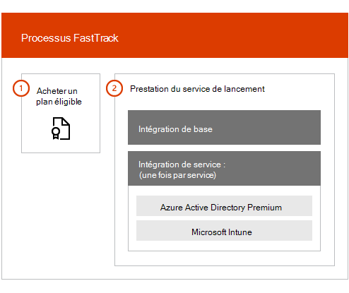

# Présentation du Centre FastTrack Benefit

Avec FastTrack Center Benefit pour Microsoft Azure Active Directory Premium, Microsoft Intune et Azure information protection, vous travaillez à distance avec les spécialistes FastTrack pour que votre environnement soit prêt à être utilisé et pour planifier le déploiement et l’utilisation au sein de votre organisations. Pour en savoir plus sur les conditions, voir[Processus du service FastTrack Center Benefit pour Enterprise Mobility + Security (EMS)](EMS-fasttrack-process.md)

L’intégration présente deux composants majeurs :

-   **Intégration de base** : tâches requises pour la configuration du client et son intégration à Azure Active Directory, si nécessaire. L’intégration de base fournit également la ligne de base pour l’intégration d’autres services Microsoft Online éligibles.

-   **Intégration de service** : tâches requises pour configurer les variantes autonomes de la charge de travail EMS (Azure AD Premium, Intune et Azure information protection).

Le diagramme suivant décrit les phases d’intégration de niveau supérieur pour le FastTrack Center Benefit.

Voici le fonctionnement du processus :

- Le centre FastTrack essaie de vous contacter pour offrir une assistance d’intégration après avoir acheté des licences d’un service éligible. Vous pouvez également demander de l’aide dans le [Centre FastTrack](https://go.microsoft.com/fwlink/?linkid=780698) si vous êtes prêt à déployer ces services pour votre organisation. Pour demander de l’aide, connectez-vous au[Centre FastTrack](https://go.microsoft.com/fwlink/?linkid=780698)à l’aide de votre compte professionnel ou scolaire, accédez au tableau de bord, développez le lien **vous avez besoin d’aide ?** dans le coin inférieur droit de la page, puis suivez les invites pour finaliser votre demande. Une fois que l’assistance en matière d’intégration débute, nous organisons un calendrier des réunions en ligne.

-   L’équipe FastTrack vous aide tout d’abord à bénéficier des principales fonctionnalités (communes à tous les services Microsoft Online Services), puis à intégrer chaque service éligible.

Toutes les recommandations d’intégration sont fournies à distance par des membres du personnel FastTrack :

-   L’équipe FastTrack vous aide à distance pour de nombreuses activités d’intégration, en utilisant une combinaison d’outils, de documentation et de conseils.

-   L’assistance en matière d’intégration est fournie par le FastTrack Center et est disponible pendant les heures normales d’ouverture pour une région donnée.

-   L’assistance est disponible en chinois traditionnel, chinois simplifié (les ressources parlent le mandarin uniquement), anglais, français, allemand, italien, japonais, coréen, portugais (Brésil), espagnol, thaï et vietnamien.

-   L’équipe FastTrack peut travailler directement avec vous ou avec votre représentant.

> [!NOTE]
> **Vous voulez en savoir plus ?** Voir [Enterprise Mobility + Security](https://www.microsoft.com/cloud-platform/enterprise-mobility).  

## Étapes suivantes

[FastTrack Center Benefit pour EMS : Attentes en matière d’environnement source](EMS-source-environment-expectations.md)
