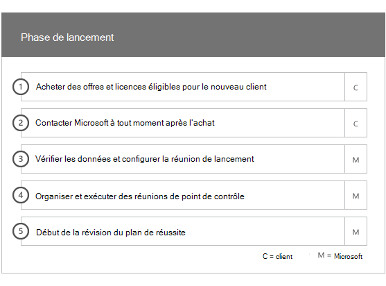
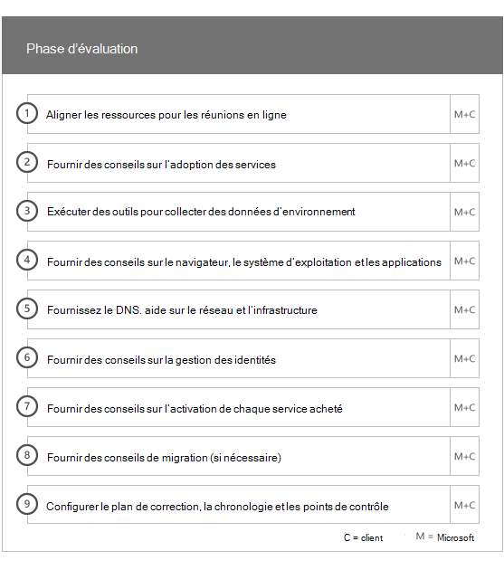
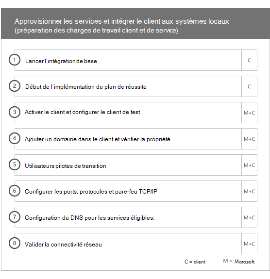
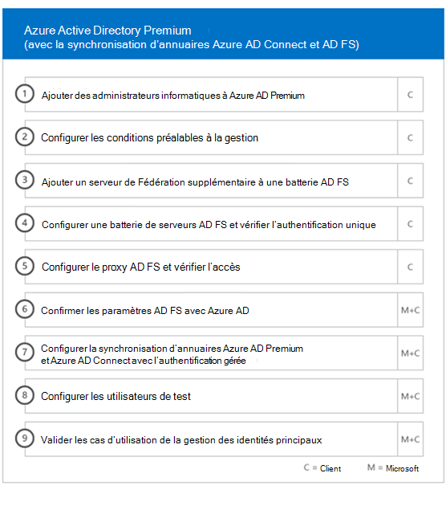
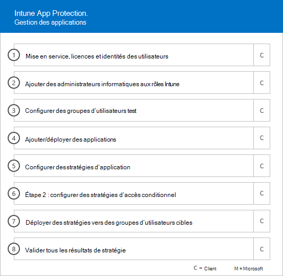
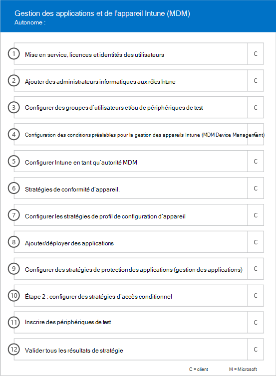

# Phases d’intégration

Lorsque vous utilisez les [services et plans éligibles](M365-eligible-services-and-plans.md)pour obtenir Microsoft Azure Active Directory Premium, Microsoft Intune et Azure information protection, plusieurs phases sont impliquées dans le processus. Les sections suivantes décrivent chaque phase du processus d’intégration.

L’intégration comprend quatre phases principales :

## Phase de lancement

Après avoir acheté le nombre approprié de licences, suivez les conseils indiqués dans le message électronique de confirmation d’achat pour associer ces licences à votre client existant ou nouveau. Microsoft vérifie ensuite votre éligibilité pour le FastTrack Center Benefit et tente de vous contacter pour offrir une assistance à l’intégration.

> [!NOTE]
> Vous pouvez également obtenir de l’aide sur le site [FastTrack](https://go.microsoft.com/fwlink/?linkid=780698) si vous êtes prêt à déployer ces services pour votre organisation.

### Pour demander de l’aide

1. Connectez-vous au [site FastTrack](https://go.microsoft.com/fwlink/?linkid=780698).
2. Sélectionnez **Obtenir de l’aide pour Microsoft 365**en utilisant les **actions rapides** en haut de votre page d’accueil ou **Obtenir de l’aide pour Microsoft 365** sur la carte de déploiement.
3. Complétez le formulaire **Obtenir de l’aide pour Microsoft 365**.

Une fois que l’assistance en matière d’intégration débute, nous organisons un calendrier des réunions en ligne.

Les partenaires Microsoft peuvent également obtenir de l’aide par le biais du [site FastTrack](https://go.microsoft.com/fwlink/?linkid=780698) pour le compte d’un client. Pour ce faire, procédez comme suit :

1. Connectez-vous au [site FastTrack](https://go.microsoft.com/fwlink/?linkid=780698).
2. Sélectionnez **Mes clients**.
3. Recherchez votre client ou sélectionnez-le dans votre liste de clients.
4. Sélectionnez **Services**.
5. Complétez le formulaire **Obtenir de l’aide pour Microsoft 365**.

Une fois la prise en charge de l’intégration prise en charge, FastTrack configure un échéancier de réunions en ligne avec vous pour discuter du processus d’intégration, vérifier les données et configurer une réunion de lancement.

## Phase d’évaluation

Une fois le processus d’intégration démarré, FastTrack Center travaillera avec vous pour évaluer votre environnement source et les conditions requises. Les outils sont exécutés pour évaluer votre environnement source et FastTrack vous guide tout au long de l'évaluation de vos navigateurs Internet, de vos systèmes d'exploitation client, de votre service DNS (Domain Name System), de votre réseau, de votre infrastructure et de votre système d'identité, afin de déterminer si des changements sont requis pour l'intégration.

FastTrack Center vous fournira également des conseils visant à réussir l’adoption des services éligibles.

En fonction de votre configuration actuelle, nous vous fournissons un plan de correction de votre environnement source visant à mettre en place la configuration minimale requise aux conditions minimales requises pour la réussite de l’intégration à EMS ou ses services cloud. Nous mettons également en place des appels de point de contrôle appropriés pour la phase de correction.

## Phase de correction
Vous effectuez les tâches figurant dans le plan de correction dans votre environnement source de façon à pouvoir remplir les conditions requises pour l’intégration et l’adoption de chaque service (si besoin).

Avant de commencer la phase d’activation, nous vérifions ensemble les résultats des activités de correction pour nous assurer que vous pouvez continuer.

## Phase d’activation
Une fois toutes les activités de correction terminées, le projet passe à la configuration de l’infrastructure de base pour la consommation de services et à l’approvisionnement de chaque service cloud EMS.

**Phase d’activation - Fonctionnalités de base**

L’intégration de base implique l’approvisionnement de services et l’intégration du locataire et de l’identité. Il décrit également les étapes à suivre pour fournir les bases de l’intégration des services en ligne tels qu’Azure AD Premium, Intune et Azure information protection.

> [!NOTE]
> WAP signifie proxy d'application Web. SSL signifie Secure Sockets Layer. SDS signifie School Data Sync. Pour plus d'informations sur SDS, consultez la rubrique [Bienvenue dans Microsoft School Data Sync](https://go.microsoft.com/fwlink/?linkid=871480).

> [!NOTE]
> Une méthode d’authentification gérée inclut, mais n’est pas limitée à la synchronisation de hachage de mot de passe. L’intégration d’identité est une activité ponctuelle et n’inclut pas la migration ou la désaffectation de méthodes d’authentification existantes, telles que géré ou fédéré.

### Phase d’activation - Azure AD Premium

L’environnement Azure AD Premium peut être configuré à l’aide de l’outil de synchronisation d’annuaires Azure Active Directory Connect et des services AD FS (Active Directory Federation Services) (selon les besoins).

Pour les scénarios Azure AD Premium qui incluent la synchronisation des identités locales avec le Cloud, nous vous aidons à ajouter des administrateurs et des utilisateurs informatiques à votre abonnement, à configurer les conditions requises pour la gestion, à configurer Azure AD Premium, à configurer l’annuaire synchronisation avec l’authentification gérée et AD FS à l’aide de l’outil Azure AD Connect, la configuration des utilisateurs de test et la validation de vos cas d’utilisation principaux pour le service.

La configuration d’Azure AD Premium inclut l’activation des fonctionnalités suivantes :

-   Réinitialisation de mot de passe libre-service Azure Active Directory.

-   Authentification multifacteur Azure

-   Jusqu’à trois (3) ou plus intégrations de logiciels comme service (SaaS) à l’aide de l'authentification unique (SSO) à partir d’[Azure Active Directory Marketplace](https://azure.microsoft.com/marketplace/active-directory/).

-   Configuration automatique des utilisateurs pour les applications SaaS intégrées répertoriées dans la [liste des didacticiels d’intégration des applications](https://docs.microsoft.com/azure/active-directory/saas-apps/tutorial-list), limitée à la configuration sortante uniquement.

-   Écran de connexion personnalisé, y compris le logo, le texte et les images.

-   Groupes libre-service et dynamiques (groupes).

-   Proxy d’application Azure Active Directory.

-   Azure Active Directory Connect Health.

-   Accès conditionnel Azure Active Directory.

-   Conditions d’utilisation d’Azure Active Directory.

-   Azure Active Directory Identity Protection.

-   Azure Active Directory Privileged Identity Management.

-   Azure Active Directory Access Reviews.

-   Protection par mot de passe Azure Active Directory.

-   Azure Active Directory B2B.

### Phase d’activation - Intune

Pour Intune, nous vous guiderons tout au long de la préparation de l’utilisation de Microsoft Intune pour la gestion des appareils. Les étapes exactes dépendent de votre environnement source et sont basées sur vos besoins en matière de gestion des applications mobiles et des appareils mobiles. La procédure inclut les étapes suivantes :

-   Licences pour les utilisateurs finaux. Nous vous proposons également des informations sur l’activation des licences en volume pour votre client de service Cloud computing Microsoft (selon vos besoins).

-   Configurer les identités pour les utiliser avec Intune, soit en tirant parti de votre Active Directory local, soit d’identités Cloud.

-   Ajouter des utilisateurs à votre abonnement Intune, définir des rôles d’administrateur informatique et créer des groupes d’utilisateurs et d’appareils.

-   Configuration de votre autorité de gestion des appareils mobiles, en fonction de vos besoins en matière de gestion, notamment :

    -   Définition d’Intune comme autorité de gestion des appareils mobiles lorsqu’ Intune est votre seule solution de gestion des appareils mobiles.

-   Recommandations en matière de gestion des appareils mobiles pour :

    -   Configuration des groupes tests à utiliser pour valider les stratégies de la gestion des périphériques mobiles.

    -   Configuration des stratégies de gestion et des services de gestion du service MDM tels que :

        -   Déploiement d’applications pour chaque plateforme prise en charge par le biais de liens Web ou de liens profonds.

        -   Stratégies d’accès conditionnel.

        -   Déploiement de messages électroniques, de réseaux sans fil et de profils VPN si vous avez une autorité de certification existante, une infrastructure Wi-Fi ou VPN au sein de votre organisation.

        -   Configurer Connecteur Microsoft Intune Exchange (le cas échéant).

        -   Connexion à Intune Data Warehouse.

        -   Intégration de Intune avec :
            -   Visionneuse d’équipe pour l’assistance à distance (l’abonnement Team Viewer est obligatoire).

            -   Solutions des partenaires pour la protection contre les menaces mobiles (MTD) (un abonnement à la protection contre les menaces mobiles est requis).

            -   Solutions de gestion des dépenses télécom (l’abonnement solutions de gestion des dépenses de télécoms est requise).

            -   Protection avancée contre les menaces Microsoft Defender (les licences Windows E5 ou Microsoft 365 E5 sont requises).

    -   Inscription de périphériques de chaque [plateforme](https://technet.microsoft.com/library/dn600287.aspx) prise en charge sur Intune.

-   Aide sur la protection des applications :

    -   Configurer des stratégies de protection des applications pour chaque plateforme prise en charge.

    -   Configuration des stratégies d’accès conditionnel pour les applications gérées.

    -   Cibler les groupes d’utilisateurs appropriés avec les stratégies GAM ci-dessus.

    -   Utilisation de rapports d’utilisation des applications gérées.

-   Conseils de gestion des PC sur :

    -   Installer le logiciel client Intune (le cas échéant).

    -   Utilisation des rapports logiciels et matériels disponibles dans Intune.

    > [!IMPORTANT]
    > FastTrack ne prend pas en charge la gestion classique de Windows 10 PC avec Intune. FastTrack prend uniquement en charge la gestion de Windows 10 via la gestion des périphériques mobiles Intune.

#### Windows Autopilot

FastTrack vous permet de simplifier la configuration de votre appareil à l’aide de Windows AutoPilot et Intune en offrant de nouveaux appareils à vos utilisateurs finaux sans avoir à créer, maintenir et appliquer des images de système d’exploitation personnalisées à vos appareils.

FastTrack prend en charge les scénarios de pilotes automatiques suivants :

- **Azure AD self-service:** les appareils rejoignent Azure AD et s’inscrivent dans Intune. Ce scénario est pris en charge lorsque vous utilisez Windows 10 1703 et les versions les plus récentes.

- **Hybrid AAD self-service :** les appareils rejoignent AD local et Azure AD et s’inscrivent dans Intune. Ce scénario est pris en charge lorsque vous utilisez Windows 10 1809 et les versions les plus récentes.

- **Configuration automatique:** les appareils rejoignent automatiquement Azure AD. Ce scénario est pris en charge lorsque vous utilisez Windows 1809 et les versions les plus récentes.

    > [!IMPORTANT]
    > FastTrack ne prend pas en charge les scénarios Autopilot initiés à partir de Configuration Manager.

La procédure de configuration de l’application Autopilot Windows dépend de votre environnement source et peut inclure les éléments suivants :

- Configurer et installer Microsoft Intune pour Windows AutoPilot.

- Configurer les groupes dynamiques Azure AD

- Ajoutez la marque de votre entreprise à Azure AD.

- Créez des appareils et attribuez-les à des profils de Windows Autopilot (par exemple, profil Windows AutoPilot restreignant la création d’un compte d’administrateur local).

- Personnalisez l’expérience OOBE (OOBE) pour vous conformer aux exigences de l’organisation.

- Configuration de l’inscription automatique de MDM dans Azure AD et Intune.

#### Déployer Outlook pour iOS et Android de façon sécurisée  

FastTrack vous permet de déployer Outlook pour iOS et Android de façon sécurisée au sein de votre organisation afin de vous assurer que toutes les applications requises sont installées sur vos utilisateurs.

La procédure de déploiement sécurisé d’Outlook Mobile pour iOS et Android avec Intune dépend de votre environnement source et peut inclure les éléments suivants :

- Téléchargez Outlook pour iOS et Android, Microsoft Authenticator et l’application Intune Company Portal via l’App Store d’Apple ou Google Play Store.
- Fournit également des instructions sur la configuration de :
    - Outlook pour iOS et Android, Microsoft Authenticator et l’application Intune Company Portal avec Intune.
    - Stratégies de protection des applications
    - Stratégies d’accès conditionnel
    - Stratégies de configuration des applications

    > [!IMPORTANT]
    > L’équipe FastTrack ne prend pas en charge la sécurisation d’Outlook pour iOS et Android avec les stratégies de boîte aux lettres d’appareil mobile Exchange.

#### Attachement via le cloud

FastTrack vous guide dans le cadre de la préparation à l’attachement via le cloud d’environnements Configuration Manager existants avec Intune. Les étapes exactes dépendent de votre environnement source. La procédure inclut les étapes suivantes :

- Explication des avantages de l’attachement via le cloud de Configuration Manager avec Intune.

- Licences pour les utilisateurs finaux. FastTrack fournit également des informations sur l’activation des licences en volume pour votre client de service cloud Microsoft (selon vos besoins).

- Configurer les identités pour les utiliser avec Intune en tirant parti de votre Active Directory local et des identités cloud.

- Ajouter des utilisateurs à votre abonnement Intune, définir des rôles d’administrateur informatique et créer des groupes d’utilisateurs et d’appareils.

- Activer l’attachement via le cloud dans la console Configuration Manager.

- Fourniture de conseils sur la configuration hybride Azure Active Directory Join.

- Fourniture de conseils sur la configuration d’Azure Active Directory pour l’inscription automatique à la gestion des périphériques mobiles.

- Fourniture de conseils sur la configuration de la passerelle de gestion cloud.

- Configuration des charges de travail prises en charge que vous voulez basculer vers Intune.

- Installation du client Configuration Manager dans les appareils inscrits sur Intune.

Microsoft fournit également des conseils pour réussir l’adoption de vos services éligibles.

 

#### Phase d’activation - Azure Information Protection

Fournit des instructions sur la façon de procéder aux clients pour : 

- Activer et configurer son client.
- Créer et configurer des étiquettes et des stratégies.
- Application de la protection des informations aux documents. 
- Classifier et étiqueter automatiquement des informations dans les applications Office (telles que Word, PowerPoint, Excel et Outlook) exécutées sur Windows et utilisant le client Azure information protection.
- Utilisation des fichiers au repos avec l’analyseur Azure information protection.
- Surveillance des courriers électroniques en transit à l’aide de règles de flux de messagerie Exchange Online.

Des instructions sont également fournies aux clients qui souhaitent appliquer une protection à l’aide de Microsoft Azure Rights Management Services (Azure RMS), d’Office 365 Encryption (OME) et de protection contre la perte de données (DLP).

> [!NOTE]
> **Vous voulez en savoir plus ?** Voir [Enterprise Mobility + Security](https://www.microsoft.com/cloud-platform/enterprise-mobility).  

## Étapes suivantes

[Avantages de FastTrack pour EMS - Vos responsabilités Microsoft](EMS-fasttrack-responsibilities.md)

