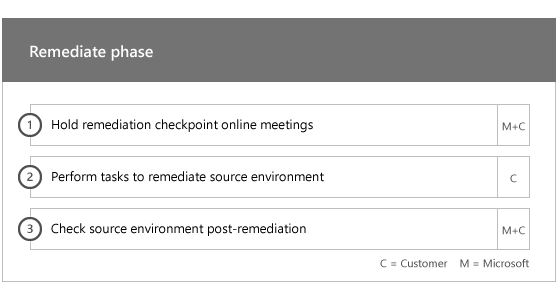

# Phases d’intégrationOnboarding Phases

Lorsque vous utilisez les [services et plans éligibles](M365-eligible-services-and-plans.md)pour obtenir Microsoft Azure Active Directory Premium, Microsoft Intune et Azure information protection, plusieurs phases sont impliquées dans le processus.When you use the [Eligible Services and Plans](M365-eligible-services-and-plans.md) to get Microsoft Azure Active Directory Premium, Microsoft Intune, and Azure Information Protection ready for use, there are several phases involved in the process. Les sections suivantes décrivent chaque phase du processus d’intégration.The following sections describe each phase of the onboarding process.

L’intégration comprend quatre phases principales :Onboarding has four primary phases:

## Phase de lancementInitiate phase

Après avoir acheté le nombre approprié de licences, suivez les conseils indiqués dans le message électronique de confirmation d’achat pour associer ces licences à votre client existant ou nouveau.After you purchase the appropriate number and types of licenses, follow the guidance from the purchase confirmation email to associate the licenses to your existing or new tenant. Microsoft vérifie ensuite votre éligibilité pour le FastTrack Center Benefit et tente de vous contacter pour offrir une assistance à l’intégration.Microsoft then verifies your eligibility for the FastTrack Center Benefit and tries to contact you to offer onboarding assistance.

> [!NOTE]
> Vous pouvez également demander de l’aide dans le [Centre FastTrack](https://go.microsoft.com/fwlink/?linkid=780698) si vous êtes prêt à déployer ces services pour votre organisation.You can also request assistance from the [FastTrack Center](https://go.microsoft.com/fwlink/?linkid=780698) if you're ready to deploy these services for your organization.

### Pour demander de l’aideTo request assistance

1. Connectez-vous au [site FastTrack](https://go.microsoft.com/fwlink/?linkid=780698).Sign in to the [FastTrack site](https://go.microsoft.com/fwlink/?linkid=780698).
2. Sélectionnez **FastTrack**.Select **FastTrack**.
3. Sélectionnez **Services**.Select **Services**.
4. Complétez le formulaire **Demande d’assistance avec Microsoft 365**.Complete the **Request for Assistance with Microsoft 365** form.

Une fois que l’assistance en matière d’intégration débute, nous organisons un calendrier des réunions en ligne.Once onboarding assistance starts, we set up a schedule of online meetings.

Les partenaires Microsoft peuvent également obtenir de l’aide par le biais du [site FastTrack](https://go.microsoft.com/fwlink/?linkid=780698) pour le compte d’un client.Partners can also get help through the [FastTrack site](https://go.microsoft.com/fwlink/?linkid=780698) on behalf of a customer. Pour ce faire, procédez comme suit :To do so:

1. Connectez-vous au [site FastTrack](https://go.microsoft.com/fwlink/?linkid=780698).Sign in to the [FastTrack site](https://go.microsoft.com/fwlink/?linkid=780698).
2. Sélectionnez **FastTrack**.Select **FastTrack**.
3. Sélectionnez **Mes clients**.Select **My Customers**.
4. Recherchez votre client ou sélectionnez-le dans votre liste de clients.Search for your customer or select them from your customer list.
5. Sélectionnez **Services**.Select **Services**.
6. Complétez le formulaire **Demande d’assistance avec Microsoft 365**.Complete the **Request for Assistance with Microsoft 365** form.

Une fois la prise en charge de l’intégration prise en charge, FastTrack configure un échéancier de réunions en ligne avec vous pour discuter du processus d’intégration, vérifier les données et configurer une réunion de lancement.Once the onboarding support starts, FastTrack sets up a schedule of online meetings with you to discuss the onboarding process, verify data, and set up a kick-off meeting.

## Phase d’évaluationAssess phase

Une fois le processus d’intégration démarré, FastTrack Center travaillera avec vous pour évaluer votre environnement source et les conditions requises.Once the onboarding process begins, the FastTrack Center works with you to assess your source environment and the requirements. Les outils sont exécutés pour évaluer votre environnement source et FastTrack vous guide tout au long de l'évaluation de vos navigateurs Internet, de vos systèmes d'exploitation client, de votre service DNS (Domain Name System), de votre réseau, de votre infrastructure et de votre système d'identité, afin de déterminer si des changements sont requis pour l'intégration.Tools are run to assess your environment, and FastTrack Specialists guide you through assessing your on-premises Active Directory, Internet browsers, client devices' operating systems, Domain Name System (DNS), network, infrastructure, and identity system to determine if any changes are required for onboarding.

FastTrack Center vous fournira également des conseils visant à réussir l’adoption des services éligibles.The FastTrack Center also connects you with guidance about how to drive successful adoption of the eligible services.

En fonction de votre configuration actuelle, nous vous fournissons un plan de correction de votre environnement source visant à mettre en place la configuration minimale requise aux conditions minimales requises pour la réussite de l’intégration à EMS ou ses services cloud.Based on your current setup, we provide a remediation plan that brings your source environment up to the minimum requirements for successful onboarding to O365_W14_2nd and, if needed, for successful mailbox and/or data migration. Nous mettons également en place des appels de point de contrôle appropriés pour la phase de correction.We also set up appropriate checkpoint calls for the Remediate phase.

## Phase de correctionRemediate phase
Vous effectuez les tâches figurant dans le plan de correction dans votre environnement source de façon à pouvoir remplir les conditions requises pour l’intégration et l’adoption de chaque service (si besoin).You perform the tasks in the remediation plan on your source environment so that you meet the requirements for onboarding and adopting each service (as needed).

Avant de commencer la phase d’activation, nous vérifions ensemble les résultats des activités de correction pour nous assurer que vous pouvez continuer.Before beginning the Enable phase, we jointly verify the outcomes of the remediation activities to make sure you’re ready to proceed.

## Phase d’activationEnable phase
Une fois toutes les activités de correction terminées, le projet passe à la configuration de l’infrastructure de base pour la consommation de services et à l’approvisionnement de chaque service cloud EMS.When all remediation activities are complete, the focus shifts to configuring the core infrastructure for service consumption, provisioning O365_W14_2nd, and conducting the activities to drive service adoption.

**Phase d’activation - Fonctionnalités de base****Enable phase - Core capabilities**

L’intégration de base implique l’approvisionnement de services et l’intégration du locataire et de l’identité.Core onboarding involves service provisioning and tenant and identity integration. Il décrit également les étapes à suivre pour fournir les bases de l’intégration des services en ligne tels qu’Azure AD Premium, Intune et Azure information protection.It also includes steps for providing a foundation for onboarding online services like Azure AD Premium, Intune, and Azure Information Protection.

> [!NOTE]
> WAP signifie proxy d'application Web. SSL signifie Secure Sockets Layer. SDS signifie School Data Sync. Pour plus d'informations sur SDS, consultez la rubrique [Bienvenue dans Microsoft School Data Sync](https://go.microsoft.com/fwlink/?linkid=871480).WAP stands for Web Application Proxy. SSL stands for Secure Sockets Layer. SDS stands for School Data Sync. For more information on SDS, see [Welcome to Microsoft School Data Sync](https://go.microsoft.com/fwlink/?linkid=871480).

> [!NOTE]
> Une méthode d’authentification gérée inclut, mais n’est pas limitée à la synchronisation de hachage de mot de passe.A managed authentication method includes, but is not limited to password hash synchronization. L’intégration d’identité est une activité ponctuelle et n’inclut pas la migration ou la désaffectation de méthodes d’authentification existantes, telles que géré ou fédéré.Identity integration is a one time activity and does not include migrating or decommissioning of existing authentication methods, such as managed or federated.

### Phase d’activation - Azure AD PremiumEnable phase - Azure AD Premium

L’environnement Azure AD Premium peut être configuré à l’aide de l’outil de synchronisation d’annuaires Azure Active Directory Connect et des services AD FS (Active Directory Federation Services) (selon les besoins).The Azure AD Premium environment can be set up by using the Azure Active Directory Connect tool directory synchronization and Active Directory Federation Services (AD FS) (as needed).

Pour les scénarios Azure AD Premium qui incluent la synchronisation des identités locales avec le Cloud, nous vous aidons à ajouter des administrateurs et des utilisateurs informatiques à votre abonnement, à configurer les conditions requises pour la gestion, à configurer Azure AD Premium, à configurer l’annuaire synchronisation avec l’authentification gérée et AD FS à l’aide de l’outil Azure AD Connect, la configuration des utilisateurs de test et la validation de vos cas d’utilisation principaux pour le service.For Azure AD Premium scenarios that include synchronizing on-premises identities to the cloud, we help you by adding IT admins and users to your subscription, configuring management prerequisites, setting up Azure AD Premium, setting up directory synchronization with managed authentication and AD FS using the Azure AD Connect tool, configuring test users, and validating your core use cases for the service.

La configuration d’Azure AD Premium inclut l’activation des fonctionnalités suivantes :Azure AD Premium setup includes enabling the following features:

-   Réinitialisation de mot de passe libre-service Azure Active Directory.Azure Active Directory Self-Service Password Reset (SSPR).

-   Authentification multifacteur AzureAzure Multi-Factor Authentication (Azure MFA).

-   Jusqu’à trois (3) ou plus intégrations de logiciels comme service (SaaS) à l’aide de l'authentification unique (SSO) à partir d’[Azure Active Directory Marketplace](https://azure.microsoft.com/marketplace/active-directory/).Up to three (3) or more Software as a Service (SaaS) application integrations with Single Sign-On (SSO) from the [Azure Active Directory Marketplace](https://azure.microsoft.com/marketplace/active-directory/).

-   Configuration automatique des utilisateurs pour les applications SaaS intégrées répertoriées dans la [liste des didacticiels d’intégration des applications](https://docs.microsoft.com/fr-FR/azure/active-directory/saas-apps/tutorial-list), limitée à la configuration sortante uniquement.Automatic user provisioning for pre-integrated SaaS applications as listed in the [App integration tutorial list](https://docs.microsoft.com/en-us/azure/active-directory/saas-apps/tutorial-list), limited to outbound provisioning only.

-   Écran de connexion personnalisé, y compris le logo, le texte et les images.Customized logon screen, including logo, text, and images.

-   Groupes libre-service et dynamiques (groupes).Self-Service and Dynamic Groups (Groups).

-   Proxy d’application Azure Active Directory.Azure Active Directory Application Proxy.

-   Azure Active Directory Connect Health.Azure Active Directory Connect

-   Accès conditionnel Azure Active Directory.Azure Active Directory Conditional Access

-   Conditions d’utilisation d’Azure Active Directory.Azure Active Directory Terms of Use.

-   Azure Active Directory Identity Protection.Azure Active Directory Identity Protection

-   Azure Active Directory Privileged Identity Management.Azure Active Directory Privileged Identity Management.

-   Azure Active Directory Access Reviews.Azure Active Directory Conditional Access

### Phase d’activation - IntuneEnable phase - Intune

Pour Intune, nous vous guiderons tout au long de la préparation de l’utilisation de Microsoft Intune pour la gestion des appareils.For Intune, we guide you through getting ready to use Microsoft Intune to manage devices. Les étapes exactes dépendent de votre environnement source et sont basées sur vos besoins en matière de gestion des applications mobiles et des appareils mobiles.The exact steps depend on your source environment and are based on your mobile device and mobile app management needs. La procédure inclut les étapes suivantes :The steps include:

-   Licences pour les utilisateurs finaux.Licensing your end users. Nous vous proposons également des informations sur l’activation des licences en volume pour votre client de service Cloud computing Microsoft (selon vos besoins).We also provide assistance on how to activate volume licenses for your Microsoft cloud service tenant (as needed).

-   Configurer les identités pour les utiliser avec Intune, soit en tirant parti de votre Active Directory local, soit d’identités Cloud.Configuring identities to be used by Intune by leveraging either your on-premises Active Directory or cloud identities.

-   Ajouter des utilisateurs à votre abonnement Intune, définir des rôles d’administrateur informatique et créer des groupes d’utilisateurs et d’appareils.Adding users to your Intune subscription, defining IT admin roles, and creating user and device groups.

-   Configuration de votre autorité de gestion des appareils mobiles, en fonction de vos besoins en matière de gestion, notamment :Configuring your Mobile Device Management (MDM) authority, based on your management needs, including:

    -   Définir Intune comme autorité GPM lorsque Intune est votre seule solution de gestion ou est en conjonction avec des périphériques mobiles pour Office 365.Setting Intune as your MDM authority when Intune is your only MDM solution or is in conjunction with Mobile Device Management for Office 365.

-   Recommandations en matière de gestion des périphériques mobiles pour :Providing MDM guidance for:

    -   Configuration des groupes tests à utiliser pour valider les stratégies de la gestion des périphériques mobiles.Configuring tests groups to be used to validate MDM management policies.

    -   Configuration des stratégies de gestion et des services de gestion du service MDM tels que :Configuring MDM management policies and services like:

        -   Déploiement d’applications pour chaque plateforme prise en charge par le biais de liens Web ou de liens profonds.Application deployment for each supported platform through web links or deep links.

        -   Stratégies d’accès conditionnel.Conditional access device policies

        -   Déploiement de messages électroniques, de réseaux sans fil et de profils VPN si vous avez une autorité de certification existante, une infrastructure Wi-Fi ou VPN au sein de votre organisation.Deployment of email, wireless networks, and virtual private network (VPN) profiles if you have an existing  certificate authority, Wi-Fi or VPN infrastructure in your organization.

        -   Configurer Connecteur Microsoft Intune Exchange (le cas échéant).Setting up the Microsoft Intune Exchange Connector (when applicable).

        -   Connexion à Intune Data Warehouse.Connecting to Intune Data Warehouse

        -   Intégration de Intune avec :Integrating Intune with:
            -   Visionneuse d’équipe pour l’assistance à distance (l’abonnement Team Viewer est obligatoire).Team Viewer for remote assistance (Team viewer subscription is required).

            -   Solutions pour les partenaires mobiles pour la défense contre les menaces Mobile Threat Defense (l’abonnement Mobile Threat Defense est requis).Mobile Threat Defense (MTD) partner solutions (Mobile Threat Defense subcription is required).

            -   Solutions de gestion des dépenses télécom (l’abonnement solutions de gestion des dépenses de télécoms est requise).Telecom expense management solution (Telecom expense management solution subscription is required).

            -   Protection avancée contre les menaces Windows Defender (les licences Windows E5 ou Microsoft 365 E5 sont requises).Windows Defender Advanced Threat Protection (Windows E5 or Microsoft 365 E5 licenses are required).

    -   Inscription de périphériques de chaque [plateforme](https://technet.microsoft.com/library/dn600287.aspx) prise en charge sur Intune.Enrolling devices of each [supported platform](https://technet.microsoft.com/library/dn600287.aspx) to Intune.

-   Aide sur la protection des applications :Providing App Protection guidance on:

    -   Configurer des stratégies de protection des applications pour chaque plateforme prise en charge.Configuring app protection policies for each supported platform.

    -   Configuration des stratégies d’accès conditionnel pour les applications gérées.Configuring conditional access policies for managed apps.

    -   Cibler les groupes d’utilisateurs appropriés avec les stratégies GAM ci-dessus.Targeting the appropriate user groups with the above MAM policies.

    -   Utilisation de rapports d’utilisation des applications gérées.Using managed-applications usage reports.

-   Conseils de gestion des PC sur :Providing PC management guidance on:

    -   Installer le logiciel client Intune (le cas échéant).Installing the Intune client software (when needed).

    -   Utilisation des rapports logiciels et matériels disponibles dans Intune.Using the software and hardware reports available in Intune.

    > [!IMPORTANT]
    > FastTrack ne prend pas en charge la gestion classique de Windows 10 PC avec Intune.FastTrack does not support Windows 10 classic PC management with Intune. FastTrack prend uniquement en charge la gestion de Windows 10 via la gestion des périphériques mobiles Intune.FastTrack only supports Windows 10 device management through Intune mobile device management (MDM).

#### Windows AutopilotWindows Autopilot

FastTrack vous permet de simplifier la configuration de votre appareil à l’aide de Windows AutoPilot et Intune en offrant de nouveaux appareils à vos utilisateurs finaux sans avoir à créer, maintenir et appliquer des images de système d’exploitation personnalisées à vos appareils.FastTrack can help you through simplifying your device provisioning with Windows Autopilot and Intune by giving new devices to your end users without the need to build, maintain and apply custom operating system images to your devices.

FastTrack prend en charge les scénarios de pilotes automatiques suivants :FastTrack supports the following Autopilot scenarios:

- **Azure AD self-service:** les appareils rejoignent Azure AD et s’inscrivent dans Intune.**Azure AD self-service:** Devices join Azure AD and enroll into Intune. Ce scénario est pris en charge lorsque vous utilisez Windows 10 1703 et les versions les plus récentes.This scenario is supported when using Windows 10 1703 and latest versions.

- **Hybrid AAD self-service :** les appareils rejoignent AD local et Azure AD et s’inscrivent dans Intune.**Hybrid AAD self-service:** Devices join both on-premises AD and Azure AD and enroll into Intune. Ce scénario est pris en charge lorsque vous utilisez Windows 10 1809 et les versions les plus récentes.This scenario is supported when using Windows 10 1809 and latest versions.

- **Configuration automatique:** les appareils rejoignent automatiquement Azure AD.**Self-provisioning:** Devices automatically join Azure AD. Ce scénario est pris en charge lorsque vous utilisez Windows 1809 et les versions les plus récentes.This scenario is supported when using Windows 1809 and latest versions.

    > [!IMPORTANT]
    > FastTrack ne prend pas en charge les scénarios Autopilot initiés à partir de Configuration Manager.FastTrack does not support Autopilot scenarios initiated from Configuration Manager.

La procédure de configuration de l’application Autopilot Windows dépend de votre environnement source et peut inclure les éléments suivants :The steps to setup Windows Autopilot depends on your source environment and it can include:

- Configurer et installer Microsoft Intune pour Windows AutoPilot.Configure and setup Microsoft Intune for Windows Autopilot.

- Configurer les groupes dynamiques Azure ADConfigure Azure AD dynamic groups

- Ajoutez la marque de votre entreprise à Azure AD.Add your Company branding into Azure AD.

- Créez des appareils et attribuez-les à des profils de Windows Autopilot (par exemple, profil Windows AutoPilot restreignant la création d’un compte d’administrateur local).Create and assign devices to Windows Autopilot profiles (e.g a Windows Autopilot profile that restricts Local Administrator account creation).

- Personnalisez l’expérience OOBE (OOBE) pour vous conformer aux exigences de l’organisation.Customize the Out-of-box-experience (OOBE) to comply with organization's requirements.

- Configuration de l’inscription automatique de MDM dans Azure AD et Intune.Configuring MDM Auto-enrollment in Azure AD and Intune.

#### Déployer Outlook pour iOS et Android de façon sécurisée  Outlook for iOS and Android

FastTrack vous permet de déployer Outlook pour iOS et Android de façon sécurisée au sein de votre organisation afin de vous assurer que toutes les applications requises sont installées sur vos utilisateurs.FastTrack can help you by deploying Outlook for iOS and Android securely in your organization to ensure your users have all the required apps installed.

La procédure de déploiement sécurisé d’Outlook Mobile pour iOS et Android avec Intune dépend de votre environnement source et peut inclure les éléments suivants :The steps to securely deploy Outlook Mobile for iOS and Android with Intune depends on your source environment and it can include:

- Téléchargez Outlook pour iOS et Android, Microsoft Authenticator et l’application Intune Company Portal via l’App Store d’Apple ou Google Play Store.Download Outlook for iOS and Android, Microsoft Authenticator and the Intune Company portal app via the Apple App Store or Google Play Store.
- Fournit également des instructions sur la configuration de :Also provide guidance on setting up:
    - Outlook pour iOS et Android, Microsoft Authenticator et l’application Intune Company Portal avec Intune.Outlook for iOS and Android, Microsoft Authenticator and the Intune Company portal app deployment with Intune.
    - Stratégies de protection des applicationsApp protection policies
    - Stratégies d’accès conditionnelConditional access device policies
    - Stratégies de configuration des applicationsApp configuration policies

    > [!IMPORTANT]
    > L’équipe FastTrack ne prend pas en charge la sécurisation d’Outlook pour iOS et Android avec les stratégies de boîte aux lettres d’appareil mobile Exchange.FastTrack team does not support securing Outlook for iOS and Android with Exchange mobile device mailbox policies.

#### Co-ManagementCo-management

FastTrack vous guide dans la préparation de la gestion simultanée des appareils Windows 10 avec Configuration Manager et Intune.FastTrack guides you through getting ready to concurrently manage Windows 10 devices with both Configuration Manager and Intune. Les étapes exactes dépendent de votre environnement source et peuvent inclure les éléments suivants :The exact steps, depending on your source environment and your email migration plans, can include providing guidance for:

- Expliquer les avantages de la co-direction.Explain the benefits of Co-management.

- Octroyer une licence à vos utilisateurs finaux.License your end users. FastTrack fournit également des informations sur l’activation des licences en volume pour votre client de service Cloud Microsoft (selon vos besoins).FastTrack also provides assistance on how to activate volume licenses for your Microsoft cloud service tenant (as needed).

- Configurer les identités pour les utiliser avec Intune, soit en tirant parti de votre Active Directory local, soit d’identités Cloud.Configure identities to be used by Intune by leveraging either your on-premises Active Directory and/or cloud identities.

- Ajouter des utilisateurs à votre abonnement Intune, définir des rôles d’administrateur informatique et créer des groupes d’utilisateurs et d’appareils.Adding users to your Intune subscription, defining IT admin roles, and creating user and device groups.

- Fournit des instructions sur la migration de Intune intégré avec System Center Configuration Manager (hybride) vers Intune standalone.Provide guidance on how to move from Intune integrated with System Center Configuration Manager (Hybrid) to Intune Standalone.

- Configuration d’Azure Active Directory pour l’inscription automatique à la gestion des périphériques mobiles.Provide guidance on setting up Azure Active Directory for MDM auto-enrollment.

- Fournit des conseils pour la configuration hybride Azure Active Directory Join.Provide guidance setting up hybrid Azure Active Directory Join.

- Fournir des instructions sur la configuration de la passerelle de gestion CloudProvide guidance on how to set up Cloud Management Gateway

- Activer co-gestion dans la console Configuration Manager.Enable Co-management in Configuration Manager console.

- Configure les charges de travail prises en charge que vous voulez basculer vers Intune.Configure supported workloads that you want to switch to Intune.

- Installe le client Configuration Manager dans les appareils inscrits sur Intune.Install Configuration Manager client in Intune enrolled devices.

- Fournit des conseils sur la surveillance de l’activité de co-gestion dans votre environnement.Provide guidance on how to monitor the Co-management activity in your environment.

Microsoft vous fournit également des conseils pour réussir l’adoption de vos services éligibles.FastTrack also provides you guidance on how to drive successful adoption of the eligible services.

#### Phase d’activation - Azure Information ProtectionEnable phase – Azure Information Protection

Fournit des instructions sur la façon de procéder aux clients pour :Customers are provided guidance on how to: 

- Activer et configurer son client.Activate and configure their tenant.
- Créer et configurer des étiquettes et des stratégies.Create and set up labels and policies.
- Application de la protection des informations aux documents.Apply information protection to documents. 
- Classifier et étiqueter automatiquement des informations dans les applications Office (telles que Word, PowerPoint, Excel et Outlook) exécutées sur Windows et utilisant le client Azure information protection.Automatically classify and label information in Office apps (like Word, PowerPoint, Excel, and Outlook) running on Windows and using the Azure Information Protection client.
- Utilisation des fichiers au repos avec l’analyseur Azure information protection.Use files at rest using the Azure Information Protection scanner.
- Surveillance des courriers électroniques en transit à l’aide de règles de flux de messagerie Exchange Online.Monitor emails in transit using Exchange Online mail flow rules.

Des instructions sont également fournies aux clients qui souhaitent appliquer une protection à l’aide de Microsoft Azure Rights Management Services (Azure RMS), d’Office 365 Encryption (OME) et de protection contre la perte de données (DLP).Guidance is also provided to customers who want to apply protection using Microsoft Azure Rights Management Services (Azure RMS), Office 365 Message Encryption (OME), and data loss prevention (DLP).

> [!NOTE]
> **Vous voulez en savoir plus ?** Voir [Enterprise Mobility + Security](https://www.microsoft.com/en-us/cloud-platform/enterprise-mobility).  **Want to learn more?** see [Enterprise Mobility + Security](https://www.microsoft.com/en-us/cloud-platform/enterprise-mobility).

## Étapes suivantesNext steps

[Avantages de FastTrack pour EMS - Vos responsabilités MicrosoftFastTrack benefit for EMS - Microsoft responsibilities](EMS-fasttrack-responsibilities.md)
