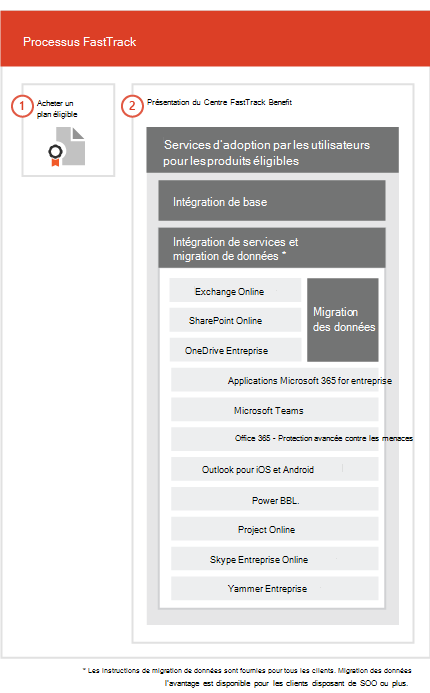

# Processus FastTrackThe FastTrack Process

Le processus de FastTrack propose des services pour l’adoption utilisateur et l’intégration. The FastTrack process provides onboarding and user adoption services. 
  
L’intégration se compose des éléments suivants :Onboarding consists of:
  
- *Core onboarding* — These are tasks required for tenant configuration and integration with Azure Active Directory (Azure AD) if needed.*Core onboarding* — These are tasks required for tenant configuration and integration with Azure Active Directory (Azure AD) if needed. Core onboarding also provides the baseline for onboarding other eligible services.Core onboarding also provides the baseline for onboarding other eligible services. 
- *Service onboarding and migration* — Service onboarding tasks enable scenarios in your tenant.*Service onboarding and migration* — Service onboarding tasks enable scenarios in your tenant. Data migration (including email and files) is covered in [Data Migration](O365-data-migration.md).Data migration (including email and files) is covered in [Data Migration](O365-data-migration.md). 
    
User adoption services are comprised of tasks that provide guidance for you to ensure your users are aware of the eligible services and can use them to drive business value.User adoption services are comprised of tasks that provide guidance for you to ensure your users are aware of the eligible services and can use them to drive business value. This assistance occurs in parallel to onboarding activities.This assistance occurs in parallel to onboarding activities.
  
> [!NOTE]
> FastTrack provides customers with a recommended approach, guidance, and best practices engineered to deliver quick and predictable outcomes.FastTrack provides customers with a recommended approach, guidance, and best practices engineered to deliver quick and predictable outcomes. If you choose to deploy outside of this guidance, your onboarding experience and usage of the service may be impacted.If you choose to deploy outside of this guidance, your onboarding experience and usage of the service may be impacted. Guidance is defined as a combination of verbal and written assistance.Guidance is defined as a combination of verbal and written assistance. When FastTrack Specialists provide guidance, FastTrack personnel cannot act on your behalf.When FastTrack Specialists provide guidance, FastTrack personnel cannot act on your behalf. You can use FastTrack services to onboard and adopt any qualifying product workload as long as your subscription is current.You can use FastTrack services to onboard and adopt any qualifying product workload as long as your subscription is current. 
  
## Le processus d’intégrationThe onboarding process

Le diagramme suivant illustre le processus d’intégration.The following diagram illustrates the onboarding process.
  

  
Vous pouvez obtenir de l’aide par le biais du [Centre d’administration Microsoft 365](https://go.microsoft.com/fwlink/?linkid=2032704) ou du [site FastTrack](https://go.microsoft.com/fwlink/?linkid=780698).You can get help through the [Microsoft 365 admin center](https://go.microsoft.com/fwlink/?linkid=2032704) or the [FastTrack site](https://go.microsoft.com/fwlink/?linkid=780698). 

Pour obtenir de l’aide par le biais du [Centre d’administration Microsoft 365](https://go.microsoft.com/fwlink/?linkid=2032704), votre administrateur se connecte au Centre d’administration, puis clique sur le widget **Besoin d’aide ?**.To get help through the [Microsoft 365 admin center](https://go.microsoft.com/fwlink/?linkid=2032704), your admin signs into the admin center and then clicks the **Need help?** widget. 

Pour obtenir de l’aide par le biais du [site FastTrack](https://go.microsoft.com/fwlink/?linkid=780698) :To get help through the [FastTrack site](https://go.microsoft.com/fwlink/?linkid=780698): 
1.    Connectez-vous au [site FastTrack](https://go.microsoft.com/fwlink/?linkid=780698).Sign in to the [FastTrack site](https://go.microsoft.com/fwlink/?linkid=780698). 
2.    Sélectionnez **Obtenir de l’aide pour Microsoft 365**en utilisant les **actions rapides** en haut de votre page d’accueil ou **Obtenir de l’aide pour Microsoft 365** sur la carte de déploiement.Select **Request assistance for Microsoft 365** from the **quick actions** on the top of your landing page or by selecting **Request assistance for Microsoft 365** on the deploy card.
3.    Complétez le formulaire **Obtenir de l’aide pour Microsoft 365**.Complete the **Request Assistance for Microsoft 365** form. 
  
 Vous pouvez également demander de l’aide pour le Centre FastTrack sur le [site FastTrack](https://go.microsoft.com/fwlink/?linkid=780698), dans la liste des services disponibles pour votre client.You can also ask for FastTrack Center help from the [FastTrack site](https://go.microsoft.com/fwlink/?linkid=780698) in the list of available services for your tenant. 
    
 Quand l’assistance en matière d’intégration débute, nous créons un calendrier de réunions en ligne.Once onboarding assistance starts, we set up a schedule of online meetings.
    
Partners can also get help through the [FastTrack site](https://go.microsoft.com/fwlink/?linkid=780698) on behalf of a customer.Partners can also get help through the [FastTrack site](https://go.microsoft.com/fwlink/?linkid=780698) on behalf of a customer. To do so:To do so:
1.    Connectez-vous au [site FastTrack](https://go.microsoft.com/fwlink/?linkid=780698).Sign in to the [FastTrack site](https://go.microsoft.com/fwlink/?linkid=780698). 
2.    Sélectionnez **Mes clients**.Select **My Customers**.
3.    Recherchez votre client ou sélectionnez-le dans votre liste de clients.Search for your customer or select them from your customer list.
4.    Sélectionnez **Services**.Select **Services**.
5.    Complétez le formulaire **Obtenir de l’aide pour Microsoft 365**.Complete the **Request Assistance for Microsoft 365** form. 

Le tableau suivant répertorie les rôles et responsabilités nécessaires pour le processus.The following table lists roles and responsibilities for the process.
    
|||
|:-----|:-----|
|**Rôle****Role**   |**Responsabilité****Responsibility**   |
|**Spécialiste FastTrack****FastTrack Specialist**   |Propose tous les services d’intégration, de migration et d’adoption par les utilisateurs à distance.Provides all onboarding, migration, and user adoption services remotely.    Vous aide à distance à l’aide d’un ensemble d’outils et de documents publiés.Assists you remotely by using a combination of tools and published documentation.   Travaille directement avec vous ou votre représentant.Works directly with you or your representative.   Fournit des conseils concernant la migration de la messagerie et des données.Provides email and data migration guidance.|
|**Service FastTrack****FastTrack Center**    |Fournit des conseils pour l’intégration de base et de service, et la planification visant à réussir l’adoption des services éligibles.Provides guidance with core and service onboarding and planning successful adoption of eligible services.    Assure l’assistance et est disponible pendant les heures normales d’ouverture de chaque région.Provides assistance and is available during normal business hours for a given region.   Fournit une assistance en chinois traditionnel, chinois simplifié (les ressources parlent le mandarin uniquement), anglais, français, allemand, italien, japonais, coréen, portugais (Brésil), espagnol, thaï et vietnamien.Provides assistance in Traditional Chinese and Simplified Chinese (resources speak Mandarin only), English, French, German, Italian, Japanese, Korean, Portuguese (Brazil), Spanish, Thai, and Vietnamese.|
