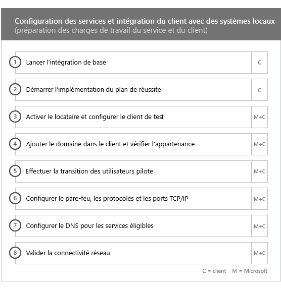
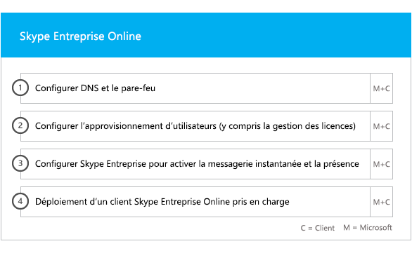
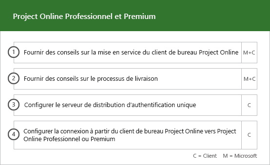

# Phases d’intégration et de migration

Office 365 onboarding has four primary phases—Initiate, Assess, Remediate, and Enable. You can follow these phases with an optional data migration phase as shown in the following figure.
  

  
> [!NOTE]
>Pour plus d’informations sur l’intégration et la migration concernant Office 365 pour le gouvernement américain, consulter[Intégration et Migration pour Office 365 pour le gouvernement américain](US-Gov-appendix-onboarding-and-migration.md). 

Pour obtenir les tâches détaillées de chaque phase, voir [Responsabilités FastTrack](O365-fasttrack-responsibilities.md) et [Vos responsabilités](O365-your-responsibilities.md).
  
## Phase de lancement

Après avoir acheté le nombre et le type appropriés de licences, suivez les conseils indiqués dans le message électronique de confirmation d’achat pour associer ces licences à votre client existant ou nouveau. 
  
Vous pouvez obtenir de l’aide par le biais du [Centre d’administration Microsoft 365](https://go.microsoft.com/fwlink/?linkid=2032704) ou du [site FastTrack](https://go.microsoft.com/fwlink/?linkid=780698). 

Pour obtenir de l’aide par le biais du [Centre d’administration Microsoft 365](https://go.microsoft.com/fwlink/?linkid=2032704), votre administrateur se connecte au Centre d’administration, puis clique sur le widget **Besoin d’aide ?**. 

Pour obtenir de l’aide par le biais du [site FastTrack](https://go.microsoft.com/fwlink/?linkid=780698) : 
1.    Connectez-vous au [site FastTrack](https://go.microsoft.com/fwlink/?linkid=780698). 
2.    Sélectionnez **Obtenir de l’aide pour Microsoft 365**en utilisant les **actions rapides** en haut de votre page d’accueil ou **Obtenir de l’aide pour Microsoft 365** sur la carte de déploiement.
3.    Complétez le formulaire **Obtenir de l’aide pour Microsoft 365**. 
  
Partners can also get help through the [FastTrack site](https://go.microsoft.com/fwlink/?linkid=780698) on behalf of a customer. To do so:
1.    Connectez-vous au [site FastTrack](https://go.microsoft.com/fwlink/?linkid=780698). 
2.    Sélectionnez **Mes clients**.
3.    Recherchez votre client ou sélectionnez-le dans votre liste de clients.
4.    Sélectionnez **Services**.
5.    Complétez le formulaire **Obtenir de l’aide pour Microsoft 365**.

Vous pouvez également demander de l’aide pour le Centre FastTrack sur le [site FastTrack](https://go.microsoft.com/fwlink/?linkid=780698), dans la liste des services disponibles pour votre client. 
    
During this phase, we discuss the onboarding process, verify your data, and set up a kickoff meeting. This includes working with you to understand how you intend to use the service and your organization's goals and plans to drive service usage.
  

  
## Phase d’évaluation

Your FastTrack Manager conducts an interactive success planning call with you and your adoption team. This introduces you to the capabilities of the eligible services you purchased, the key foundations you need for success, the methodology for driving usage of the service, and scenarios you can use to get value from the services. We assist you in success planning and provide feedback on key areas (as needed).
  
FastTrack Specialists work with you to assess your source environment and the requirements. We provide tools for you to gather data about your environment and  guide you through estimating bandwidth requirements and assessing your internet browsers, client operating systems, Domain Name System (DNS), network, infrastructure, and identity system to determine if any changes are required for onboarding. 
  
Based on your current setup, we provide a remediation plan that brings your source environment up to the minimum requirements for successful onboarding to Office 365 and, if needed, for successful mailbox and/or data migration. We provide a set of suggested activities to increase end user value and adoption. We also set up appropriate checkpoint calls for the Remediate phase.
  

  
## Phase de correction

Les tâches de correction doivent être adaptées à votre environnement source de façon à ce que celui-ci puisse remplir les conditions requises pour l’intégration, l’adoption et la migration de chaque service.
  

  
We also provide a set of suggested activities to increase end user value and adoption. Before beginning the Enable phase, we jointly verify the outcomes of the remediation activities to make sure you're ready to proceed. 
  
Au cours de cette phase, votre responsable FastTrack travaille avec vous à la planification de votre réussite, en vous orientant vers les ressources et meilleures pratiques appropriées pour vous aider à rendre le service disponible pour votre organisation et stimuler son utilisation dans les services.
  
## Phase d’activation

Une fois toutes les activités de correction terminées, nous nous focalisons sur la configuration de l'infrastructure de base pour la consommation de service, sur l'approvisionnement d'Office 365 et sur la réalisation d'activités favorisant l'adoption des services. 
  
## Noyau

Core onboarding involves service provisioning and tenant and identity integration. It also includes steps for providing a foundation for onboarding services like Exchange Online, SharePoint Online, and Skype for Business Online. You and your FastTrack Manager continue to have success planning checkpoint meetings to evaluate progress against your goals and determine what further assistance you need.
  

  

  
> [!NOTE]
> WAP stands for Web Application Proxy. SSL stands for Secure Sockets Layer. SDS stands for School Data Sync. For more information on SDS, see [Welcome to Microsoft School Data Sync](https://go.microsoft.com/fwlink/?linkid=871480). 
  
L’intégration pour un ou plusieurs services éligibles peut commencer une fois l’intégration de base terminée.
  
## Exchange Online

For Exchange Online, we guide you through the process to get your organization ready to use email. The exact steps, depending on your source environment and your email migration plans, can include providing guidance for:
- La configuration des fonctionnalités d’Exchange Online Protection (EOP) pour tous les domaines à extension messagerie validés dans Office 365.
    > [!NOTE]
    > Vos enregistrements MX doivent pointer vers Office 365. 
- La configuration de la fonctionnalité Office 365 - Protection avancée contre les menaces (ATP) si celle-ci fait partie de votre service d’abonnement. Pour plus d’informations, consultez [Office 365 - Protection avancée contre les menaces](#office-365-advanced-threat-protection).
- Setting up the data loss prevention (DLP) feature for all mail-enabled domains validated in Office 365 as part of your subscription service. This is done once your MX records point to Office 365.
- Setting up Office 365 Message Encryption (OME) for all mail-enabled domains validated in Office 365 as part of your subscription service. This is done once your MX records point to Office 365.

> [!NOTE]
> Le service de réplication de boîte aux lettres (MRS) tente de migrer les e-mails gérés par des droits relatifs à l’information (IRM) de votre boîte aux lettres locale vers la boîte aux lettres Exchange Online correspondante. La possibilité de lire le contenu protégé après la migration dépend des modèles utilisés par le client pour le mappage et la copie des modèles AD RMS (Active Directory Rights Managed Services) vers le service Azure Rights Management (Azure RMS).

- La configuration de ports de pare-feu.
- la configuration d’un DNS, y compris les enregistrements de découverte automatique, SPF (Sender Policy Framework) et MX obligatoires (si nécessaire) ; 
- la configuration d'un flux de messagerie entre votre environnement de messagerie source et Exchange Online (si nécessaire).
- La migration de messagerie de votre environnement de messagerie source vers Office 365.
- La configuration des clients de boîte aux lettres (Outlook pour Windows, Outlook sur le web et Outlook pour iOS et Android).
    > [!NOTE]
    > Pour plus d’informations sur la migration de données et de messagerie, reportez-vous à [Migration des données](O365-data-migration.md). 
  

  
## Sharepoint Online et OneDrive Entreprise

Pour SharePoint Online et OneDrive Entreprise, nous fournissons des conseils pour les étapes suivantes :
- Configuration de DNS.
- la configuration de ports de pare-feu ;
- la mise en service des utilisateurs et des licences ;   
- la configuration des fonctionnalités Environnement hybride SharePoint, telles que la recherche hybride, les sites hybrides, la taxonomie hybride, les types de contenu, la création de sites en libre-service hybride (SharePoint Server 2013 uniquement), le lanceur d’applications étendu, OneDrive Entreprise hybride et les sites extranet.
    
Les spécialistes FastTrack fournissent des conseils sur la migration des données vers Office 365 à l'aide d'un ensemble d'outils et de documents, ainsi qu'en effectuant des tâches de configuration dès que cela est nécessaire et possible.
  

  
## OneDrive Entreprise

Pour OneDrive Entreprise, les étapes varient selon que vous utilisez ou non SharePoint pour l’instant et, si oui, selon la version utilisée. 
  

  
## Office 365 – Protection avancée contre les menaces

Pour Office 365 – Protection avancée contre les menaces, nous fournissons des conseils pour les étapes suivantes :
- Activation de liens fiables, de pièces jointes fiables et de l’anti-hameçonnage. 
- Configuration de l’automatisation, de l’investigation et de la réponse.
- Utilisation du Simulateur d’attaques.
- Création de rapports et analytique des menaces.

## Gouvernance des informations Microsoft

Pour la Gouvernance des informations Microsoft, nous offrons des conseils pour :

- Gouvernance des informations.
- Étiquettes et stratégies de rétention.
- Gestion des enregistrements.
- Stratégies de suppression.
- Conformité des communications.
- Gestion des risques internes 
- Advanced eDiscovery.

## Protection des informations Microsoft

Pour la Protection des informations Microsoft, nous offrons des conseils pour :
- Prenez connaissance de vos données via l’Explorateur de contenu et l’Explorateur d’activités.
- Étiquettes de confidentialité.
- Classification des données.
- Stratégies de protection contre la perte de données (DLP) pour les conversations et canaux Microsoft Teams.
- Protection des informations.
- Étiquetage unifié.

## Microsoft Teams

Pour Microsoft Teams, nous fournissons des conseils pour les éléments suivants :
- Vérification de la configuration minimale requise.  
- la configuration de ports de pare-feu ;   
- Configuration de DNS. 
- Confirmation que Microsoft Teams est activé sur votre client Office 365.  
- Activation ou désactivation des licences utilisateur.
    

## Skype Entreprise Online

Pour Skype Entreprise Online, nous fournissons des conseils pour les étapes suivantes :
- la configuration de ports de pare-feu ;
- Configuration de DNS.   
- la création de comptes pour les périphériques système de salle de réunion ;   
- le déploiement d'un client Skype Entreprise Online pris en charge ;  
- l'établissement d'une configuration de serveur de domaines séparés entre votre environnement de serveur local Lync 2010, Lync 2013 ou Skype Entreprise 2015 et le client Skype Entreprise Online (si applicable), les plans d'appel, la diffusion de réunion Skype et le système téléphonique/les plans d'appel (dans les pays disponibles).
    

  

  
## Power BI

Pour Power BI, nous fournissons des conseils pour les étapes suivantes : 
- Attribution de licences Power BI.
- Déploiement de l'application Power BI Desktop.
    
## Project Online

Pour Project Online, nous fournissons des conseils pour :
  
- la vérification de la fonctionnalité SharePoint de base sur laquelle Project Online s'appuie ;   
- l'ajout du service Project Online à votre client (y compris en ajoutant des abonnements à des utilisateurs) ;  
- la configuration de la liste des ressources d’entreprise (ERP) ; 
- la création de votre premier projet. 
    

  
## Project Online Professionnel et Project Online Premium

Pour Project Online Professionnel et Project Online Premium, nous fournissons des conseils pour les étapes suivantes :
- Résolution des problèmes de déploiement.
- Attribution des licences utilisateur final à l’aide du [Centre d’administration Microsoft 365](https://go.microsoft.com/fwlink/?linkid=2032704) et de Windows PowerShell.  
- Installation du client de bureau Project Online à partir du portail Office 365 avec l’option Démarrer en un clic.
- Configuration des paramètres de mise à jour à l’aide de l’outil Déploiement d’Office 365.  
- Configuration d’un serveur de distribution sur site unique pour le client de bureau Project Online, incluant l’assistance concernant la création d’un fichier configuration.xml à utiliser avec l’outil Déploiement d’Office 365.  
- Connexion du client de bureau Project Online à Project Online Professionnel ou Project Online Premium.
    

  
## Yammer Entreprise

Pour Yammer, nous fournissons des conseils concernant l’activation du service Yammer Entreprise.
  
## Microsoft 365 Apps

Pour Microsoft 365 Apps, nous fournissons des conseils dans les domaines suivants :
- Résolution des problèmes de déploiement.   
- Attribution des licences utilisateur final et basées sur l’appareil à l’aide du [Centre d’administration Microsoft 365](https://go.microsoft.com/fwlink/?linkid=2032704) et de Windows PowerShell. 
- Installation de Microsoft 365 Apps à partir du portail Office 365 avec l’option Démarrer en un clic.   
- Installation des applications Office Mobile (comme Outlook Mobile, Word Mobile, Excel Mobile et PowerPoint Mobile) sur vos appareils iOS ou Android.   
- Configuration des paramètres de mise à jour à l’aide de l’outil Déploiement d’Office 365.   
- Sélection et configuration d’une installation locale ou dans le cloud. 
- Création du code XML de configuration de l’outil de déploiement d’Office avec l’outil de personnalisation d’Office ou de code XML natif pour configurer le package de déploiement.  
- Déploiement à l’aide de Microsoft Endpoint Configuration Manager, incluant une assistance à la création du packaging Microsoft Endpoint Configuration Manager.
    

  
## Outlook pour iOS et Android

Pour Outlook pour iOS et Android, nous fournissons des conseils concernant les étapes suivantes :
- Téléchargement d’Outlook pour iOS et Android depuis l’App Store d’Apple et Google Play.
- Configuration des comptes et accès à la boîte aux lettres Exchange Online.
