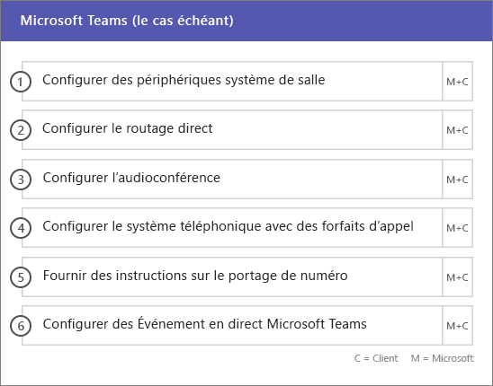

# Phases d’intégration et de migrationOnboarding and Migration Phases

Office 365 onboarding has four primary phases—Initiate, Assess, Remediate, and Enable.Office 365 onboarding has four primary phases—Initiate, Assess, Remediate, and Enable. You can follow these phases with an optional data migration phase as shown in the following figure.You can follow these phases with an optional data migration phase as shown in the following figure.
  

  
> [!NOTE]
>Pour plus d’informations sur l’intégration et la migration concernant Office 365 pour le gouvernement américain, consulter[Intégration et Migration pour Office 365 pour le gouvernement américain](US-Gov-appendix-onboarding-and-migration.md).For information on onboarding and migration for Office 365 US Government, see [Onboarding and Migration for Office 365 US Government](US-Gov-appendix-onboarding-and-migration.md). 

Pour obtenir les tâches détaillées de chaque phase, voir [Responsabilités FastTrack](O365-fasttrack-responsibilities.md) et [Vos responsabilités](O365-your-responsibilities.md).For detailed tasks for each phase, see [FastTrack Responsibilities](O365-fasttrack-responsibilities.md) and [Your Responsibilities](O365-your-responsibilities.md).
  
## Phase de lancementInitiate phase

Après avoir acheté le nombre et le type appropriés de licences, suivez les conseils indiqués dans le message électronique de confirmation d’achat pour associer ces licences à votre client existant ou nouveau.After you purchase the appropriate number and types of licenses, follow the guidance from the purchase confirmation email to associate the licenses to your existing or new tenant. 
  
Vous pouvez obtenir de l’aide par le biais du [Centre d’administration Microsoft 365](https://go.microsoft.com/fwlink/?linkid=2032704) ou du [site FastTrack](https://go.microsoft.com/fwlink/?linkid=780698).You can get help through the [Microsoft 365 admin center](https://go.microsoft.com/fwlink/?linkid=2032704) or the [FastTrack site](https://go.microsoft.com/fwlink/?linkid=780698). 

Pour obtenir de l’aide par le biais du [Centre d’administration Microsoft 365](https://go.microsoft.com/fwlink/?linkid=2032704), votre administrateur se connecte au Centre d’administration, puis clique sur le widget **Besoin d’aide ?**.To get help through the [Microsoft 365 admin center](https://go.microsoft.com/fwlink/?linkid=2032704), your admin signs into the admin center and then clicks the **Need help?** widget. 

Pour obtenir de l’aide par le biais du [site FastTrack](https://go.microsoft.com/fwlink/?linkid=780698) :To get help through the [FastTrack site](https://go.microsoft.com/fwlink/?linkid=780698): 
1.    Connectez-vous au [site FastTrack](https://go.microsoft.com/fwlink/?linkid=780698).Sign in to the [FastTrack site](https://go.microsoft.com/fwlink/?linkid=780698). 
2.    Sélectionnez **Obtenir de l’aide pour Microsoft 365**en utilisant les **actions rapides** en haut de votre page d’accueil ou **Obtenir de l’aide pour Microsoft 365** sur la carte de déploiement.Select **Request assistance for Microsoft 365** from the **quick actions** on the top of your landing page or by selecting **Request assistance for Microsoft 365** on the deploy card.
3.    Complétez le formulaire **Obtenir de l’aide pour Microsoft 365**.Complete the **Request Assistance for Microsoft 365** form. 
  
Partners can also get help through the [FastTrack site](https://go.microsoft.com/fwlink/?linkid=780698) on behalf of a customer.Partners can also get help through the [FastTrack site](https://go.microsoft.com/fwlink/?linkid=780698) on behalf of a customer. To do so:To do so:
1.    Connectez-vous au [site FastTrack](https://go.microsoft.com/fwlink/?linkid=780698).Sign in to the [FastTrack site](https://go.microsoft.com/fwlink/?linkid=780698). 
2.    Sélectionnez **Mes clients**.Select **My Customers**.
3.    Recherchez votre client ou sélectionnez-le dans votre liste de clients.Search for your customer or select them from your customer list.
4.    Sélectionnez **Services**.Select **Services**.
5.    Complétez le formulaire **Obtenir de l’aide pour Microsoft 365**.Complete the **Request Assistance for Microsoft 365** form.

Vous pouvez également demander de l’aide pour le Centre FastTrack sur le [site FastTrack](https://go.microsoft.com/fwlink/?linkid=780698), dans la liste des services disponibles pour votre client.You can also ask for FastTrack Center help from the [FastTrack site](https://go.microsoft.com/fwlink/?linkid=780698) in the list of available services for your tenant. 
    
During this phase, we discuss the onboarding process, verify your data, and set up a kickoff meeting.During this phase, we discuss the onboarding process, verify your data, and set up a kickoff meeting. This includes working with you to understand how you intend to use the service and your organization's goals and plans to drive service usage.This includes working with you to understand how you intend to use the service and your organization's goals and plans to drive service usage.
  

  
## Phase d’évaluationAssess phase

Your FastTrack Manager conducts an interactive success planning call with you and your adoption team.Your FastTrack Manager conducts an interactive success planning call with you and your adoption team. This introduces you to the capabilities of the eligible services you purchased, the key foundations you need for success, the methodology for driving usage of the service, and scenarios you can use to get value from the services.This introduces you to the capabilities of the eligible services you purchased, the key foundations you need for success, the methodology for driving usage of the service, and scenarios you can use to get value from the services. We assist you in success planning and provide feedback on key areas (as needed).We assist you in success planning and provide feedback on key areas (as needed).
  
FastTrack Specialists work with you to assess your source environment and the requirements.FastTrack Specialists work with you to assess your source environment and the requirements. We provide tools for you to gather data about your environment and  guide you through estimating bandwidth requirements and assessing your internet browsers, client operating systems, Domain Name System (DNS), network, infrastructure, and identity system to determine if any changes are required for onboarding.We provide tools for you to gather data about your environment and  guide you through estimating bandwidth requirements and assessing your internet browsers, client operating systems, Domain Name System (DNS), network, infrastructure, and identity system to determine if any changes are required for onboarding. 
  
Based on your current setup, we provide a remediation plan that brings your source environment up to the minimum requirements for successful onboarding to Office 365 and, if needed, for successful mailbox and/or data migration.Based on your current setup, we provide a remediation plan that brings your source environment up to the minimum requirements for successful onboarding to Office 365 and, if needed, for successful mailbox and/or data migration. We provide a set of suggested activities to increase end user value and adoption.We provide a set of suggested activities to increase end user value and adoption. We also set up appropriate checkpoint calls for the Remediate phase.We also set up appropriate checkpoint calls for the Remediate phase.
  

  
## Phase de correctionRemediate phase

Les tâches de correction doivent être adaptées à votre environnement source de façon à ce que celui-ci puisse remplir les conditions requises pour l’intégration, l’adoption et la migration de chaque service.You do the remediation tasks based on your source environment so that you meet the requirements for onboarding, adopting, and migrating each service as needed.
  

  
We also provide a set of suggested activities to increase end user value and adoption.We also provide a set of suggested activities to increase end user value and adoption. Before beginning the Enable phase, we jointly verify the outcomes of the remediation activities to make sure you're ready to proceed.Before beginning the Enable phase, we jointly verify the outcomes of the remediation activities to make sure you're ready to proceed. 
  
Au cours de cette phase, votre responsable FastTrack travaille avec vous à la planification de votre réussite, en vous orientant vers les ressources et meilleures pratiques appropriées pour vous aider à rendre le service disponible pour votre organisation et stimuler son utilisation dans les services.During this phase, your FastTrack Manager works with you on success planning, guiding you to the right resources and best practices to provide guidance for you to make the service available to your organization and drive usage across the services.
  
## Phase d’activationEnable phase

Une fois toutes les activités de correction terminées, nous nous focalisons sur la configuration de l'infrastructure de base pour la consommation de service, sur l'approvisionnement d'Office 365 et sur la réalisation d'activités favorisant l'adoption des services.When all remediation activities are complete, the focus shifts to configuring the core infrastructure for service consumption, provisioning Office 365, and conducting the activities to drive service adoption. 
  
## NoyauCore

Core onboarding involves service provisioning and tenant and identity integration.Core onboarding involves service provisioning and tenant and identity integration. It also includes steps for providing a foundation for onboarding services like Exchange Online, SharePoint Online, and Skype for Business Online.It also includes steps for providing a foundation for onboarding services like Exchange Online, SharePoint Online, and Skype for Business Online. You and your FastTrack Manager continue to have success planning checkpoint meetings to evaluate progress against your goals and determine what further assistance you need.You and your FastTrack Manager continue to have success planning checkpoint meetings to evaluate progress against your goals and determine what further assistance you need.
  

  

  
> [!NOTE]
> WAP stands for Web Application Proxy.WAP stands for Web Application Proxy. SSL stands for Secure Sockets Layer.SSL stands for Secure Sockets Layer. SDS stands for School Data Sync. For more information on SDS, see [Welcome to Microsoft School Data Sync](https://go.microsoft.com/fwlink/?linkid=871480).SDS stands for School Data Sync. For more information on SDS, see [Welcome to Microsoft School Data Sync](https://go.microsoft.com/fwlink/?linkid=871480). 
  
L’intégration pour un ou plusieurs services éligibles peut commencer une fois l’intégration de base terminée.Onboarding for one or more eligible services can begin once core onboarding is finished.
  
## Exchange OnlineExchange Online

For Exchange Online, we guide you through the process to get your organization ready to use email.For Exchange Online, we guide you through the process to get your organization ready to use email. The exact steps, depending on your source environment and your email migration plans, can include providing guidance for:The exact steps, depending on your source environment and your email migration plans, can include providing guidance for:
- La configuration des fonctionnalités d’Exchange Online Protection (EOP) pour tous les domaines à extension messagerie validés dans Office 365.Setting up Exchange Online Protection (EOP) features for all mail-enabled domains validated in Office 365.
    > [!NOTE]
    > Vos enregistrements MX doivent pointer vers Office 365.Your mail exchange (MX) records must point to Office 365. 
- La configuration de la fonctionnalité Office 365 - Protection avancée contre les menaces (ATP) si celle-ci fait partie de votre service d’abonnement.Setting up the Office 365 Advanced Threat Protection (ATP) feature if it's part of your subscription service. Pour plus d’informations, consultez [Office 365 - Protection avancée contre les menaces](#office-365-advanced-threat-protection).For more information, see [Office 365 Advanced Threat Protection](#office-365-advanced-threat-protection).
- Setting up the data loss prevention (DLP) feature for all mail-enabled domains validated in Office 365 as part of your subscription service.Setting up the data loss prevention (DLP) feature for all mail-enabled domains validated in Office 365 as part of your subscription service. This is done once your MX records point to Office 365.This is done once your MX records point to Office 365.
- Setting up Office 365 Message Encryption (OME) for all mail-enabled domains validated in Office 365 as part of your subscription service.Setting up Office 365 Message Encryption (OME) for all mail-enabled domains validated in Office 365 as part of your subscription service. This is done once your MX records point to Office 365.This is done once your MX records point to Office 365.

> [!NOTE]
> Le service de réplication de boîte aux lettres (MRS) tente de migrer les e-mails gérés par des droits relatifs à l’information (IRM) de votre boîte aux lettres locale vers la boîte aux lettres Exchange Online correspondante.The Mailbox Replication service (MRS) attempts to migrate Information Rights Managed (IRM) emails from your on-premises mailbox to the corresponding Exchange Online mailbox. La possibilité de lire le contenu protégé après la migration dépend des modèles utilisés par le client pour le mappage et la copie des modèles AD RMS (Active Directory Rights Managed Services) vers le service Azure Rights Management (Azure RMS).Ability to read the protected content post-migration depends on the customer mapping and copying Active Directory Rights Managed Services (AD RMS) templates to the Azure Rights Management Service (Azure RMS).

- La configuration de ports de pare-feu.Configuring firewall ports.
- la configuration d’un DNS, y compris les enregistrements de découverte automatique, SPF (Sender Policy Framework) et MX obligatoires (si nécessaire) ;Setting up DNS, including the required Autodiscover, sender policy framework (SPF), and MX records (as needed). 
- la configuration d'un flux de messagerie entre votre environnement de messagerie source et Exchange Online (si nécessaire).Setting up email flow between your source messaging environment and Exchange Online (as needed).
- La migration de messagerie de votre environnement de messagerie source vers Office 365.Undertaking mail migration from your source messaging environment to Office 365.
- La configuration des clients de boîte aux lettres (Outlook pour Windows, Outlook sur le web et Outlook pour iOS et Android).Configuring mailbox clients (Outlook for Windows, Outlook on the web, and Outlook for iOS and Android).
    > [!NOTE]
    > Pour plus d’informations sur la migration de données et de messagerie, reportez-vous à [Migration des données](O365-data-migration.md).For more information on mail and data migration, see [Data Migration](O365-data-migration.md). 
  

  
## Sharepoint Online et OneDrive EntrepriseSharePoint Online and OneDrive for Business

Pour SharePoint Online et OneDrive Entreprise, nous fournissons des conseils pour les étapes suivantes :For SharePoint Online and OneDrive for Business, we provide guidance for:
- Configuration de DNS.Setting up DNS.
- la configuration de ports de pare-feu ;Configuring firewall ports.
- la mise en service des utilisateurs et des licences ;Provisioning users and licenses.   
- la configuration des fonctionnalités Environnement hybride SharePoint, telles que la recherche hybride, les sites hybrides, la taxonomie hybride, les types de contenu, la création de sites en libre-service hybride (SharePoint Server 2013 uniquement), le lanceur d’applications étendu, OneDrive Entreprise hybride et les sites extranet.Configuring SharePoint hybrid features, like hybrid search, hybrid sites, hybrid taxonomy, content types, hybrid self-service site creation (SharePoint Server 2013 only), extended app launcher, hybrid OneDrive for Business, and extranet sites.
    
Les spécialistes FastTrack fournissent des conseils sur la migration des données vers Office 365 à l'aide d'un ensemble d'outils et de documents, ainsi qu'en effectuant des tâches de configuration dès que cela est nécessaire et possible.FastTrack Specialists provide guidance on data migration to Office 365 by using a combination of tools and documentation and by performing configuration tasks where applicable and feasible.
  

  
## OneDrive EntrepriseOneDrive for Business

Pour OneDrive Entreprise, les étapes varient selon que vous utilisez ou non SharePoint pour l’instant et, si oui, selon la version utilisée.For OneDrive for Business, the steps depend on if you're currently using SharePoint, and if so, which version. 
  

  
## Office 365 – Protection avancée contre les menacesOffice 365 Advanced Threat Protection

Pour Office 365 – Protection avancée contre les menaces, nous fournissons des conseils pour les étapes suivantes :For Office 365 ATP, we provide guidance for:
- Activation de liens fiables, de pièces jointes fiables et de l’anti-hameçonnage.Enabling Safe Links, Safe Attachments, and anti-phishing. 
- Configuration de l’automatisation, de l’investigation et de la réponse.Configuring automation, investigation, and response.
- Utilisation du Simulateur d’attaques.Using Attack Simulator.
- Création de rapports et analytique des menaces.Reporting and threat analytics.

## Gouvernance des informations MicrosoftMicrosoft Information Governance

Pour la Gouvernance des informations Microsoft, nous offrons des conseils pour :For Microsoft Information Governance, we provide guidance for:

- Gouvernance des informations.Information governance.
- Étiquettes et stratégies de rétention.Retention labels and policies.
- Gestion des enregistrements.Records management.
- Stratégies de suppression.Deletion policies.
- Conformité des communications.Communication compliance.
- Gestion des risques internesInsider risk management 
- Advanced eDiscovery.Advanced eDiscovery.

## Protection des informations MicrosoftMicrosoft Information Protection

Pour la Protection des informations Microsoft, nous offrons des conseils pour :For Microsoft Information Protection, we provide guidance for:
- Prenez connaissance de vos données via l’Explorateur de contenu et l’Explorateur d’activités.Know your data through content explorer and activity explorer.
- Étiquettes de confidentialité.Sensitivity labels.
- Classification des données.Data classification.
- Stratégies de protection contre la perte de données (DLP) pour les conversations et canaux Microsoft Teams.Data loss protection (DLP) policies for Microsoft Teams chats and channels.
- Protection des informations.Information protection.
- Étiquetage unifié.Unified labeling.

## Microsoft TeamsMicrosoft Teams

Pour Microsoft Teams, nous fournissons des conseils pour les éléments suivants :For Microsoft Teams, we provide guidance for:
- Vérification de la configuration minimale requise.Confirming minimum requirements.  
- la configuration de ports de pare-feu ;Configuring firewall ports.   
- Configuration de DNS.Setting up DNS. 
- Confirmation que Microsoft Teams est activé sur votre client Office 365.Confirming Microsoft Teams is enabled on your Office 365 tenant.  
- Activation ou désactivation des licences utilisateur.Enabling or disabling user licenses.
    

## Skype Entreprise OnlineSkype for Business Online

Pour Skype Entreprise Online, nous fournissons des conseils pour les étapes suivantes :For Skype for Business Online, we provide guidance for:
- la configuration de ports de pare-feu ;Configuring firewall ports.
- Configuration de DNS.Setting up DNS.   
- la création de comptes pour les périphériques système de salle de réunion ;Creating accounts for any room system devices.   
- le déploiement d'un client Skype Entreprise Online pris en charge ;Deploying a supported Skype for Business Online client.  
- l'établissement d'une configuration de serveur de domaines séparés entre votre environnement de serveur local Lync 2010, Lync 2013 ou Skype Entreprise 2015 et le client Skype Entreprise Online (si applicable), les plans d'appel, la diffusion de réunion Skype et le système téléphonique/les plans d'appel (dans les pays disponibles).Establishing split domain server configuration between your on-premises Lync 2010, Lync 2013, or Skype for Business 2015 server environment and Skype for Business Online tenant (if applicable), Calling Plans, Skype Meeting Broadcast, and Phone System and Calling Plans (in available markets).
    

  

  
## Power BIPower BI

Pour Power BI, nous fournissons des conseils pour les étapes suivantes :For Power BI, we provide guidance for: 
- Attribution de licences Power BI.Assigning Power BI licenses.
- Déploiement de l'application Power BI Desktop.Deploying the Power BI Desktop app.
    
## Project OnlineProject Online

Pour Project Online, nous fournissons des conseils pour :For Project Online, we provide guidance for:
  
- la vérification de la fonctionnalité SharePoint de base sur laquelle Project Online s'appuie ;Verifying basic SharePoint functionality that Project Online relies on.   
- l'ajout du service Project Online à votre client (y compris en ajoutant des abonnements à des utilisateurs) ;Adding the Project Online service to your tenant (including adding subscriptions to users).  
- la configuration de la liste des ressources d’entreprise (ERP) ;Setting up the Enterprise Resource Pool (ERP). 
- la création de votre premier projet.Creating your first project. 
    

  
## Project Online Professionnel et Project Online PremiumProject Online Professional and Project Online Premium

Pour Project Online Professionnel et Project Online Premium, nous fournissons des conseils pour les étapes suivantes :For Project Online Professional and Project Online Premium, we provide guidance for:
- Résolution des problèmes de déploiement.Addressing deployment issues.
- Attribution des licences utilisateur final à l’aide du [Centre d’administration Microsoft 365](https://go.microsoft.com/fwlink/?linkid=2032704) et de Windows PowerShell.Assigning end-user licenses using the [Microsoft 365 admin center](https://go.microsoft.com/fwlink/?linkid=2032704) and Windows PowerShell.  
- Installation du client de bureau Project Online à partir du portail Office 365 avec l’option Démarrer en un clic.Installing Project Online Desktop Client from the Office 365 portal using Click-to-Run.
- Configuration des paramètres de mise à jour à l’aide de l’outil Déploiement d’Office 365.Configuring update settings using the Office 365 Deployment Tool.  
- Configuration d’un serveur de distribution sur site unique pour le client de bureau Project Online, incluant l’assistance concernant la création d’un fichier configuration.xml à utiliser avec l’outil Déploiement d’Office 365.Setting up a single on-site distribution server for Project Online Desktop Client, including assistance with the creation of a configuration.xml file for use with the Office 365 Deployment Tool.  
- Connexion du client de bureau Project Online à Project Online Professionnel ou Project Online Premium.Connecting Project Online Desktop Client to Project Online Professional or Project Online Premium.
    

  
## Yammer EntrepriseYammer Enterprise

Pour Yammer, nous fournissons des conseils concernant l’activation du service Yammer Entreprise.For Yammer, we provide guidance for enabling the Yammer Enterprise service.
  
## Microsoft 365 AppsMicrosoft 365 Apps

Pour Microsoft 365 Apps, nous fournissons des conseils dans les domaines suivants :For Microsoft 365 Apps, we provide guidance for:
- Résolution des problèmes de déploiement.Addressing deployment issues.   
- Attribution des licences utilisateur final et basées sur l’appareil à l’aide du [Centre d’administration Microsoft 365](https://go.microsoft.com/fwlink/?linkid=2032704) et de Windows PowerShell.Assigning end-user and device-based licenses using the [Microsoft 365 admin center](https://go.microsoft.com/fwlink/?linkid=2032704) and Windows PowerShell. 
- Installation de Microsoft 365 Apps à partir du portail Office 365 avec l’option Démarrer en un clic.Installing Microsoft 365 Apps from the Office 365 portal using Click-to-Run.   
- Installation des applications Office Mobile (comme Outlook Mobile, Word Mobile, Excel Mobile et PowerPoint Mobile) sur vos appareils iOS ou Android.Installing Office Mobile apps (like Outlook Mobile, Word Mobile, Excel Mobile, and PowerPoint Mobile) on your iOS or Android devices.   
- Configuration des paramètres de mise à jour à l’aide de l’outil Déploiement d’Office 365.Configuring update settings using the Office 365 Deployment Tool.   
- Sélection et configuration d’une installation locale ou dans le cloud.Selection and setup of a local or cloud installation. 
- Création du code XML de configuration de l’outil de déploiement d’Office avec l’outil de personnalisation d’Office ou de code XML natif pour configurer le package de déploiement.Creation of the Office Deployment Tool configuration XML with the Office Customization Tool or native XML to configure the deployment package.  
- Déploiement à l’aide de Microsoft Endpoint Configuration Manager, incluant une assistance à la création du packaging Microsoft Endpoint Configuration Manager.Deployment using Microsoft Endpoint Configuration Manager, including assistance with the creation of Microsoft Endpoint Configuration Manager packaging.
    

  
## Outlook pour iOS et AndroidOutlook for iOS and Android

Pour Outlook pour iOS et Android, nous fournissons des conseils concernant les étapes suivantes :For Outlook for iOS and Android, we provide guidance for:
- Téléchargement d’Outlook pour iOS et Android depuis l’App Store d’Apple et Google Play.Downloading Outlook for iOS and Android from the Apple App Store and Google Play.
- Configuration des comptes et accès à la boîte aux lettres Exchange Online.Configuring accounts and accessing the Exchange Online mailbox.
