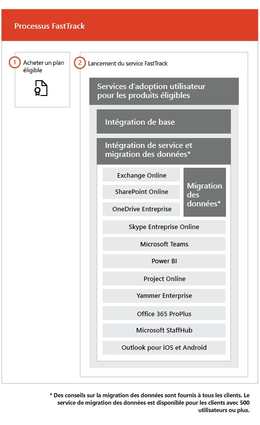

# Processus FastTrackThe FastTrack Process

Le processus de FastTrack propose des services pour l’adoption utilisateur et l’intégration. The FastTrack process provides onboarding and user adoption services. 
  
L’intégration se compose des éléments suivants :Onboarding consists of:
  
- *Intégration de base* : tâches requises pour la configuration du client et son intégration à Azure Active Directory (Azure AD), si nécessaire. L'intégration de base fournit également la ligne de base pour l'intégration d'autres services éligibles.Core onboarding — These are tasks required for tenant configuration and integration with Azure Active Directory (Azure AD) if needed. Core onboarding also provides the baseline for onboarding other eligible services. 
    
- *Intégration et migration de service* : les tâches d’intégration de service vous offrent plus de possibilités dans votre client. La migration de données (notamment fichiers et e-mails) est abordée dans la rubrique sur la [migration de données](data-migration.md).*Service onboarding and migration* — Service onboarding tasks enable scenarios in your tenant. Data migration (including email and files) is covered in [Data Migration](data-migration.md). 
    
Les services d’adoption utilisateur se composent de tâches qui vous aident à vérifier que vos utilisateurs connaissent les services éligibles et qu’ils peuvent les utiliser pour dynamiser la valeur commerciale. Cette aide est offerte en parallèle aux activités d’intégration.User adoption services are comprised of tasks that provide guidance for you to ensure your users are aware of the eligible services and can use them to drive business value. This assistance occurs in parallel to onboarding activities.
  
> [!NOTE]
> FastTrack offre aux clients des méthodes recommandées, des conseils et des meilleures pratiques conçus pour offrir des résultats rapides et prévisibles. Si vous choisissez d’effectuer votre déploiement sans ces conseils, l’intégration et l’utilisation du service peuvent ne pas être aussi bonnes. Les conseils sont définis comme une combinaison d’assistance orale et écrite. Lorsque les spécialistes de FastTrack fournissent des conseils, le personnel FastTrack ne peut pas agir en votre nom. Vous pouvez utiliser les services FastTrack pour intégrer et adopter une charge de travail sélectionnée tant que votre abonnement est encore en vigueur.FastTrack provides customers with a recommended approach, guidance, and best practices engineered to deliver quick and predictable outcomes. If you choose to deploy outside of this guidance, your onboarding experience and usage of the service may be impacted. Guidance is defined as a combination of verbal and written assistance. When FastTrack Specialists provide guidance, FastTrack personnel cannot act on your behalf. You can use FastTrack services to onboard and adopt any qualifying product workload as long as your subscription is current. 
  
## Le processus d’intégrationThe onboarding process

Le diagramme suivant illustre le processus d’intégration.The following diagram illustrates the onboarding process.
  

  
- Vous pouvez obtenir de l'aide par le biais du Centre d'administration Office 365 ou du [site FastTrack](https://go.microsoft.com/fwlink/?linkid=780698). Pour obtenir de l'aide par le biais du Centre d'administration Office 365, votre administrateur se connecte au Centre d'administration, puis clique sur le widget **Besoin d'aide ?**. Pour obtenir de l'aide par le biais du [site FastTrack](https://go.microsoft.com/fwlink/?linkid=780698), connectez-vous, cliquez sur **Services** et complétez le formulaire **Demande d'assistance pour Office 365**.You can get help through the Office 365 admin center or the [FastTrack site](https://go.microsoft.com/fwlink/?linkid=780698). To get help through the Office 365 admin center, your admin signs into the admin center and then clicks the **Need help?** widget. To get help through the [FastTrack site](https://go.microsoft.com/fwlink/?linkid=780698), sign in, click **Services**, and complete the **Request Assistance for Office 365** form. 
    
    > [!NOTE]
    >  Si un partenaire est répertorié dans votre client Office 365, cette option n’apparaît pas. Pour obtenir de l’aide, consultez votre partenaire.If you have a partner listed in your Office 365 tenant, you won't see this option. Please consult your partner for assistance. 
  
    Vous pouvez également demander de l’aide pour le Centre FastTrack sur le [site FastTrack](https://go.microsoft.com/fwlink/?linkid=780698), dans la liste des services disponibles pour votre client.You can also ask for FastTrack Center help from the [FastTrack site](https://go.microsoft.com/fwlink/?linkid=780698) in the list of available services for your tenant. 
    
    Quand l’assistance en matière d’intégration débute, nous créons un calendrier de réunions en ligne.Once onboarding assistance starts, we set up a schedule of online meetings.
    
- Les partenaires peuvent également obtenir de l'aide par le biais du [site FastTrack](https://go.microsoft.com/fwlink/?linkid=780698) pour le compte d'un client. Pour ce faire, le partenaire se connecte au site, il sélectionne l'enregistrement client, il clique sur **Services** et remplit le formulaire **Demande d'assistance pour Office 365**.Partners can also get help through the [FastTrack site](https://go.microsoft.com/fwlink/?linkid=780698) on behalf of a customer. To do so, the partner signs in to the site, selects the customer record, clicks **Services**, and completes the **Request Assistance for Office 365** form. 
    
- L’équipe FastTrack fournit des conseils pour l’intégration de base et de service, et la planification visant à réussir l’adoption des services éligibles.The FastTrack team provides guidance with core and service onboarding and planning successful adoption of eligible services.
    
- FastTrack Tous les services d'intégration, de migration et d'adoption par les utilisateurs proposés par les spécialistes sont assurés à distance.FastTrack Specialists provide all onboarding, migration, and user adoption services remotely.
    
- Les spécialistes de FastTrack vous aident à distance à l’aide d’un ensemble d’outils et de documents publiés.FastTrack Specialists assist you remotely by using a combination of tools and published documentation.
    
- L'assistance est assurée par le Service FastTrack qui est disponible pendant les heures normales d'ouverture de chaque région.The FastTrack Center provides assistance and is available during normal business hours for a given region.
    
- L’assistance est disponible en chinois traditionnel, chinois simplifié (les ressources parlent le mandarin uniquement), anglais, français, allemand, italien, japonais, coréen, portugais (Brésil), espagnol, thaï et vietnamien.Assistance is available in Traditional Chinese and Simplified Chinese (resources speak Mandarin only), English, French, German, Italian, Japanese, Korean, Portuguese (Brazil), Spanish, Thai, and Vietnamese.
    
-  Les spécialistes de FastTrack peuvent travailler directement avec vous ou avec votre représentant.FastTrack Specialists can work directly with you or your representative. 
    
- Les spécialistes de FastTrack fournissent des conseils sur la migration des données et la messagerie.FastTrack Specialists provide email and data migration guidance.
    

  

