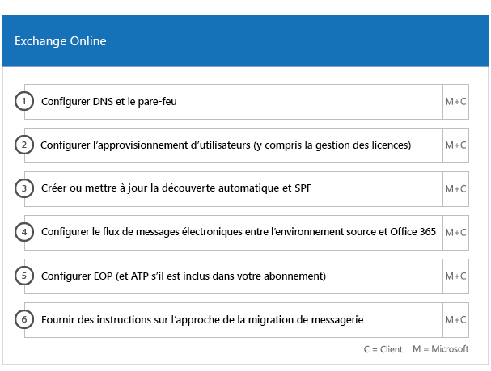

# Phases d’intégration et de migration

L'intégration Office 365 comporte quatre phases principales : lancement, évaluation, correction et activation. Vous pouvez suivre ces phases avec une étape de migration de données, comme indiqué dans l'illustration suivante.
  

  
> [!NOTE]
>Pour plus d’informations sur l’intégration et la migration concernant Office 365 pour le gouvernement américain, consulter[Intégration et Migration pour Office 365 pour le gouvernement américain](US-Gov-appendix-onboarding-and-migration.md). 

Pour obtenir les tâches détaillées de chaque phase, voir [Responsabilités FastTrack](fasttrack-responsibilities.md) et [Vos responsabilités](your-responsibilities.md).
  
## Phase de lancement

Après avoir acheté le nombre et le type appropriés de licences, suivez les conseils indiqués dans le message électronique de confirmation d’achat pour associer ces licences à votre client existant ou nouveau. 
  
- Vous pouvez obtenir de l'aide par le biais du Centre d'administration Office 365 ou du [site FastTrack](https://go.microsoft.com/fwlink/?linkid=780698). Pour obtenir de l'aide par le biais du Centre d'administration Office 365, votre administrateur se connecte au Centre d'administration, puis clique sur le widget **Besoin d'aide ?**. Pour obtenir de l'aide par le biais du [site FastTrack](https://go.microsoft.com/fwlink/?linkid=780698), connectez-vous, cliquez sur **Services** et complétez le formulaire **Demande d'assistance pour Office 365**. 
    
    > [!NOTE]
    >  Si un partenaire est répertorié dans votre client Office 365, cette option n'apparaît pas. Pour obtenir de l'aide, consultez votre partenaire. 
  
- Les partenaires peuvent également obtenir de l'aide par le biais du [site FastTrack](https://go.microsoft.com/fwlink/?linkid=780698) pour le compte d'un client. Pour ce faire, le partenaire se connecte au site, il sélectionne l'enregistrement client, il clique sur **Services** et remplit le formulaire **Demande d'assistance pour Office 365**. 
    
- Vous pouvez également demander de l’aide pour le Centre FastTrack sur le [site FastTrack](https://go.microsoft.com/fwlink/?linkid=780698), dans la liste des services disponibles pour votre client. 
    
Pendant cette phase, nous abordons le processus d’intégration, vérifions vos données et organisons une réunion de lancement.
  
Ceci inclut de collaborer avec vous afin de déterminer la façon dont vous prévoyez d'utiliser le service, ainsi que les objectifs et plans de votre organisation pour stimuler son utilisation.
  

  
## Phase d’évaluation

Votre responsable FastTrack passe un appel interactif de planification de la réussite avec vous et votre équipe d’adoption. Il présente les fonctionnalités des services éligibles que vous avez achetés, les bases clés nécessaires à votre réussite, la méthodologie pour stimuler l’utilisation du service et les scénarios que vous pouvez utiliser pour tirer parti des services. Nous vous aidons dans la planification de la réussite et vous fournissons des commentaires sur les principaux domaines (selon vos besoins).
  
Les spécialistes FastTrack travaillent avec vous pour évaluer votre environnement source et la configuration requise. Nous mettons des outils à votre disposition afin que vous puissiez recueillir des données sur votre environnement et nous vous guidons tout au long de l’estimation des exigences de bande passante et de l’évaluation de vos navigateurs Internet, de vos systèmes d’exploitation client, de votre service DNS (Domain Name System), de votre réseau, de votre infrastructure et de votre système d’identité, afin de déterminer si des changements sont requis pour l’intégration. 
  
En fonction de votre configuration actuelle, nous vous fournissons un plan de correction de votre environnement source visant à mettre en place la configuration minimale requise aux conditions minimales requises pour la réussite de l'intégration à Office 365 et, si nécessaire, pour la réussite de la migration des boîtes aux lettres et/ou des données. Nous offrons un ensemble de suggestions d'activités visant à accroître l'adoption et la valeur pour l'utilisateur final. Nous mettons également en place des appels de point de contrôle appropriés pour la phase de correction.
  

  
## Phase de correction

Les tâches de correction doivent être adaptées à votre environnement source de façon à ce que celui-ci puisse remplir les conditions requises pour l’intégration, l’adoption et la migration de chaque service.
  

  
Nous offrons également un ensemble de suggestions d'activités visant à accroître l'adoption et la valeur pour l'utilisateur final. Avant de commencer la phase d'activation, nous vérifions ensemble les résultats des activités de correction pour nous assurer que vous pouvez continuer. 
  
Au cours de cette phase, votre responsable FastTrack travaille avec vous à la planification de votre réussite, en vous orientant vers les ressources et meilleures pratiques appropriées pour vous aider à rendre le service disponible pour votre organisation et stimuler son utilisation dans les services.
  
## Phase d’activation

Une fois toutes les activités de correction terminées, nous nous focalisons sur la configuration de l'infrastructure de base pour la consommation de service, sur l'approvisionnement d'Office 365 et sur la réalisation d'activités favorisant l'adoption des services. 
  
## Noyau

L'intégration de base implique l'approvisionnement de services et l'intégration du locataire et de l'identité. Elle inclut également les étapes pour établir les fondations des services d'intégration comme Exchange Online, SharePoint Online et Skype Entreprise Online. Votre responsable FastTrack et vous continuez à avoir des réunions de point de contrôle de planification de la réussite pour évaluer l'avancement par rapport à vos objectifs et déterminer vos futurs besoins d'assistance.
  

  

  
> [!NOTE]
> WAP signifie proxy d'application Web. SSL signifie Secure Sockets Layer. SDS signifie School Data Sync. Pour plus d'informations sur SDS, consultez la rubrique [Bienvenue dans Microsoft School Data Sync](https://go.microsoft.com/fwlink/?linkid=871480). 
  
L’intégration pour un ou plusieurs services éligibles peut commencer une fois l’intégration de base terminée.
  
## Exchange Online

Pour Exchange Online, nous vous guidons au fil du processus pour préparer votre organisation à utiliser la messagerie électronique. Les étapes exactes, en fonction de votre environnement source et de vos plans de migration de messagerie, peuvent vous aider avec les opérations suivantes :
  
- La configuration des fonctionnalités d’Exchange Online Protection (EOP) pour tous les domaines à extension messagerie validés dans Office 365.
    
    > [!NOTE]
    > Vos enregistrements MX doivent pointer vers Office 365. 
  
- la configuration de la fonctionnalité Exchange Online - Protection avancée contre les menaces (ATP) si celle-ci fait partie de votre service d'abonnement une fois que vos enregistrements MX pointent vers Office 365. Cette fonctionnalité est configurée dans le cadre des paramètres anti-programme malveillant Exchange Online Protection ;
    
- la configuration de ports de pare-feu ;
    
- la configuration d’un DNS, y compris les enregistrements de découverte automatique, SPF (Sender Policy Framework) et MX obligatoires (si nécessaire) ; 
    
- la configuration d'un flux de messagerie entre votre environnement de messagerie source et Exchange Online (si nécessaire).
    
- la migration de messagerie de votre environnement de messagerie source vers Office 365.
    
    > [!NOTE]
    > Pour plus d'informations sur la migration de données et de messagerie, reportez-vous à [Migration des données](data-migration.md). 
  

  
## Sharepoint Online et OneDrive Entreprise

Pour SharePoint Online et OneDrive Entreprise, nous fournissons des conseils pour les étapes suivantes :
  
- Configuration de DNS.
    
- la configuration de ports de pare-feu ;
    
- la mise en service des utilisateurs et des licences ;
    
- la configuration des fonctionnalités Environnement hybride SharePoint, telles que la recherche hybride, les sites hybrides, la taxonomie hybride, les types de contenu, la création de sites en libre-service hybride (SharePoint Server 2013 uniquement), le lanceur d'applications étendu, OneDrive Entreprise hybride et les sites extranet.
    
Les spécialistes FastTrack fournissent des conseils sur la migration des données vers Office 365 à l'aide d'un ensemble d'outils et de documents, ainsi qu'en effectuant des tâches de configuration dès que cela est nécessaire et possible.
  

  
## OneDrive Entreprise

Pour OneDrive Entreprise, les étapes varient selon que vous utilisez ou non SharePoint pour l’instant et, si oui, selon la version utilisée. 
  

  
## Skype Entreprise Online

Pour Skype Entreprise Online, nous fournissons des conseils pour les étapes suivantes :
  
- la configuration de ports de pare-feu ;
    
- Configuration de DNS.
    
- la création de comptes pour les périphériques système de salle de réunion ;
    
- le déploiement d'un client Skype Entreprise Online pris en charge ;
    
- l'établissement d'une configuration de serveur de domaines séparés entre votre environnement de serveur local Lync 2010, Lync 2013 ou Skype Entreprise 2015 et le client Skype Entreprise Online (si applicable), les plans d'appel, la diffusion de réunion Skype et le système téléphonique/les plans d'appel (dans les pays disponibles).
    

  

  
## Microsoft Teams

Pour Microsoft Teams, nous fournissons des conseils pour les éléments suivants :
  
- Vérification de la configuration minimale requise.
    
- la configuration de ports de pare-feu ;
    
- Configuration de DNS.
    
- Confirmation que Microsoft Teams est activé sur votre client Office 365.
    
- Activation ou désactivation des licences utilisateur.
    

  
## Power BI

Pour Power BI, nous fournissons des conseils pour les étapes suivantes : 
  
- Attribution de licences Power BI.
    
- Déploiement de l'application Power BI Desktop.
    
## Project Online

Pour Project Online, nous fournissons des conseils pour :
  
- la vérification de la fonctionnalité SharePoint de base sur laquelle Project Online s'appuie ;
    
- l'ajout du service Project Online à votre client (y compris en ajoutant des abonnements à des utilisateurs) ;
    
- la configuration de la liste des ressources d’entreprise (ERP) ;
    
- la création de votre premier projet. 
    

  
## Project Online Professionnel et Project Online Premium

Pour Project Online Professionnel et Project Online Premium, nous fournissons des conseils pour les étapes suivantes :
  
- Résolution des problèmes de déploiement.
    
- Attribution des licences utilisateur final à l'aide du Centre d'administration Office 365 et de Windows PowerShell.
    
- Installation de Client de bureau Project Online à partir du portail Office 365 avec l'option Démarrer en un clic.
    
- Configuration des paramètres de mise à jour à l'aide de l'outil de déploiement Office.
    
- Configuration d'un serveur de distribution sur site unique pour Client de bureau Project Online, incluant l'assistance concernant la création d'un fichier configuration.xml à utiliser avec l'outil de déploiement Office.
    
- Connexion de Client de bureau Project Online à Project Online Professional Professionnel ou Project Online Premium.
    

  
## Yammer Entreprise

Pour Yammer, nous fournissons des conseils concernant l’activation du service Yammer Entreprise.
  
## Office 365 ProPlus

Pour Office 365 ProPlus, nous fournissons des conseils pour les étapes suivantes :
  
- Résolution des problèmes de déploiement.
    
- Attribution des licences utilisateur final à l'aide du Centre d'administration Office 365 et de Windows PowerShell.
    
- Installation de Office 365 ProPlus à partir du portail Office 365 avec l'option Démarrer en un clic.
    
- Installation des applications Office Mobile (comme Outlook Mobile, Word Mobile, Excel Mobile et PowerPoint Mobile) sur vos appareils iOS, Android ou Windows Mobile. 
    
- Configuration des paramètres de mise à jour à l'aide de l'outil de déploiement Office.
    
- Configuration d'un serveur de distribution sur site unique pour Office 365 ProPlus, incluant l'assistance concernant la création d'un fichier configuration.xml à utiliser avec l'outil de déploiement Office.
    
- Déploiement à l'aide de Microsoft System Center Configuration Manager, incluant l'assistance avec la création du packaging System Center Configuration Manager.
    

  
## Microsoft StaffHub

Pour Microsoft StaffHub, nous fournissons des conseils pour les éléments suivants :
  
- Confirmation que Microsoft StaffHub est activé sur votre client Office 365.
    
- Activation ou désactivation des licences utilisateur.
    
- Fonctionnalités de base du produit. 
    
- Emplacements de téléchargement pour Microsoft StaffHub.
    

  

  

